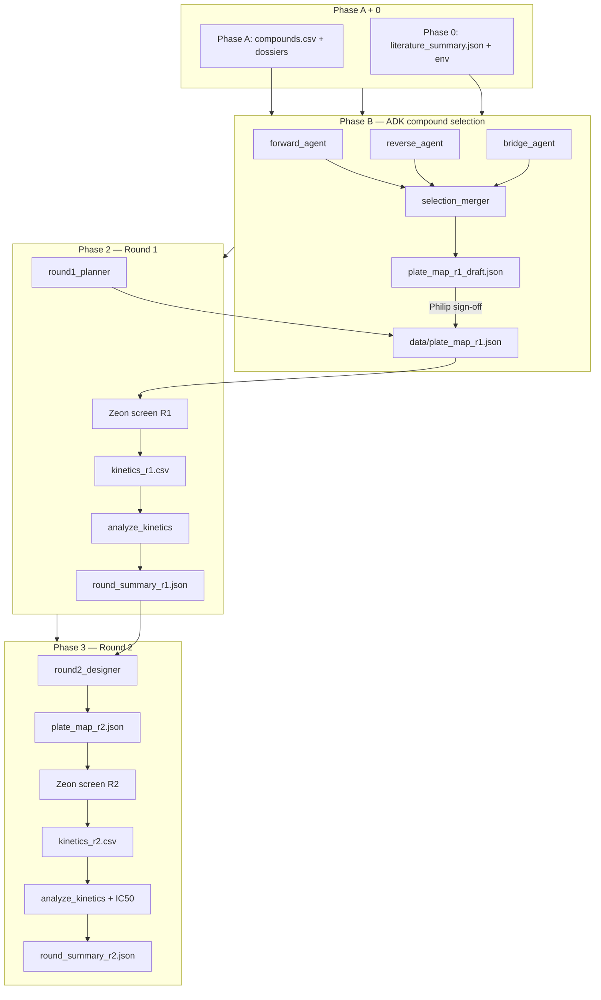
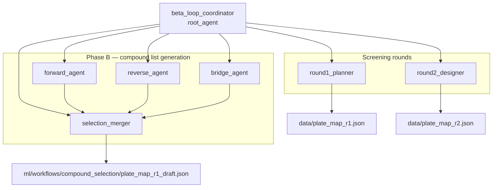
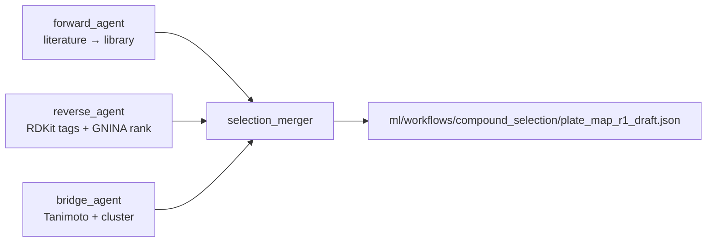
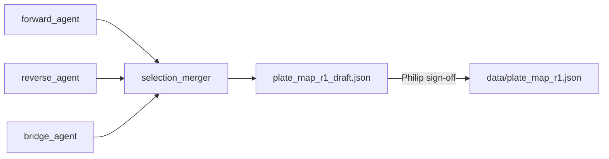
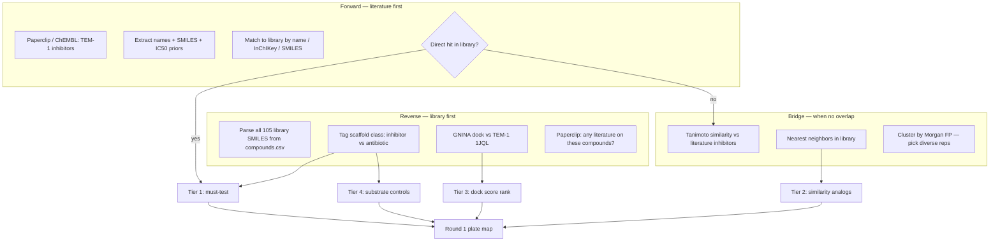
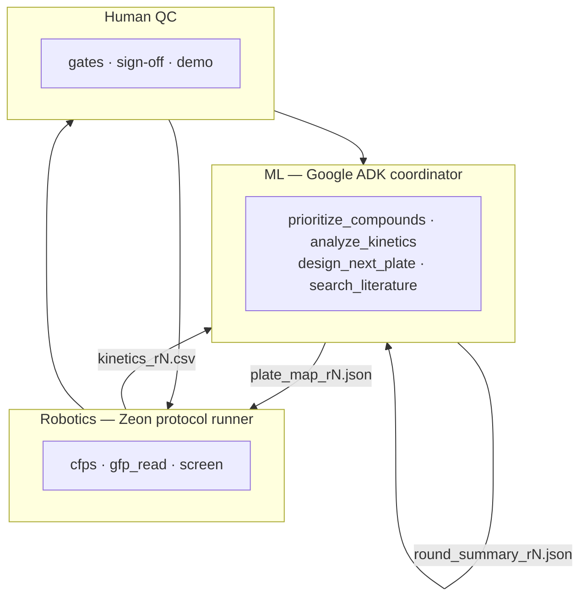
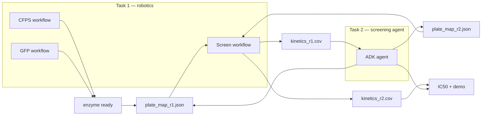

# β-Loop — architecture diagrams

Mermaid views of the ADK agent, compound-selection pipeline, and closed-loop screening flow.

**Code:** [`ml/agent/`](ml/agent/) · **Plans:** [PLAN.md](PLAN.md) · [ml/CLOSED_LOOP.md](ml/CLOSED_LOOP.md) · [pvjthomas/COMPOUND_SELECTION.md](pvjthomas/COMPOUND_SELECTION.md)

---

## Phase naming (two schemes)

| Scheme | Phases | Meaning |
|--------|--------|---------|
| **Compound list** | A → B | A = library inventory · B = ADK forward / reverse / bridge → draft plate |
| **Hackathon timeline** | 0 → 4 | 0 = prep · 1 = Sat AM · 2 = R1 · 3 = R2 · 4 = Sunday demo |

After Phase B, work shifts to **screening rounds** (`round1_planner`, `round2_designer`) and the **robot closed loop**.

---

## 1. End-to-end closed loop

Phase A inventory → Phase B selection → Round 1 → analysis → Round 2 → IC50 / demo.

---

## 2. ADK agent tree

Root coordinator and six sub-agents ([`ml/agent/agent.py`](ml/agent/agent.py)).

**Coordinator tools (also on sub-agents):** `run_compound_selection_pipeline`, `search_literature`, `analyze_kinetics`, `design_next_plate`, …

**Planned (not implemented):** wrap coordinator in ADK `LoopAgent` (max 2 iterations).

---

## 3. Phase B — sub-agent pipeline

From [PLAN.md](PLAN.md) — three deterministic passes into the merger.

With promotion gate ([`ml/workflows/compound_selection/README.md`](ml/workflows/compound_selection/README.md)):

| Pass | Agent | Key output |
|------|-------|------------|
| Forward | `forward_agent` | `reference_inhibitors.csv`, `compound_literature/refs/*.json` |
| Reverse | `reverse_agent` | `selection/state.json`, optional `dock_score` |
| Bridge | `bridge_agent` | `similarity/neighbors.json` |
| Merge | `selection_merger` | `plate_map_r1_draft.json` |

---

## 4. Forward / reverse / bridge strategy

Science-level flow from [pvjthomas/COMPOUND_SELECTION.md](pvjthomas/COMPOUND_SELECTION.md) — tiers → Round 1 plate.

---

## 5. System architecture (ML ↔ robot ↔ human)

Cross-layer file contract from [PLAN.md](PLAN.md).

---

## 6. Task 1 (robotics) ↔ Task 2 (screening)

How the two hackathon workstreams connect ([PLAN.md](PLAN.md)).

---

## Related docs

| Doc | Contents |
|-----|----------|
| [ml/agent/README.md](ml/agent/README.md) | Run commands, tool modules, file contract |
| [ml/CLOSED_LOOP.md](ml/CLOSED_LOOP.md) | Phase 0–4 checklist, R2 design rules |
| [PLAN.md](PLAN.md) | Master timeline, schemas, validation plate |
