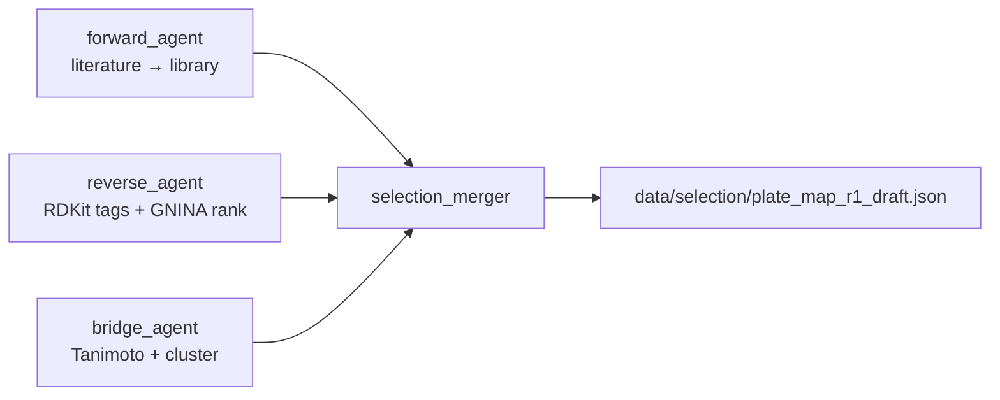

# β-Loop — Track A Project Plan

**Event:** 24hr AI for Science World Models Hack @ Zeon Systems  
**Track:** A — Close the Loop (TEM-1 β-Lactamase Inhibitor Screen)  
**Team size:** 3  
**Submit:** Sunday 2:30 PM · **Demo/Pitch:** Sunday 4:30 PM

**Teammate index:** [`data/README.md`](data/README.md) · **Storage policy:** [`data/STORAGE.md`](data/STORAGE.md)

---

## Contents

| Section | What it covers |
|---------|----------------|
| [Progress snapshot](#progress-snapshot-sat-1446) | Done / in progress / blocked |
| [Two main tasks](#two-main-tasks) | Robotics vs compound screening |
| [Compound list generation](#compound-list-generation-phase-a--phase-b) | Phase A inventory + Phase B ADK pipeline |
| [File contract](#file-contract-freeze-before-hackathon) | Schemas all layers share |
| [Assay validation](#assay-validation--prove-it-works-before-round-1) | Minimal plate before discovery |
| [Plate designs](#plate-designs) | R1 discovery vs R2 dose-response |
| [Phases 0–4](#phase-0-pre-hackathon-tonight-34-hours) | Hour-by-hour schedule |
| [Next actions](#next-actions-sat-1446) | Who does what now |

---

## Team

| Person | Role | Primary ownership |
|--------|------|-------------------|
| **Robotics** | Lab robotics | Zeon workflows, hardware booking, sim → bench execution |
| **You** | Hardware / bioengineer | Scientific QC, gate thresholds, integration glue, demo narrative |
| **ML** | ML / agent | Google ADK agent, Paperclip literature, analysis pipeline, in silico prioritization |

---

## North star

By demo time we show a real **data → decision → better result** story:

1. CFPS express TEM-1 → **GFP gate pass** → **Screen Round 1** → analyze → agent designs **Round 2** (visibly different plate)
2. IC50 on at least one true inhibitor (clavulanate / tazobactam / sulbactam class)
3. ADK agent loop with fixed file contract between layers
4. Paperclip-grounded prioritization — agent cites literature when picking Round 1 compounds and designing Round 2 dose-response

**Scoring priorities (from brief):**
- Inhibit TEM-1 as much as possible
- Best result after **two rounds**, loop closed
- Round-1 data visibly changing Round-2 plate layout

---

## Progress snapshot (Sat ~14:46)

### Planning & docs

| Item | Status |
|------|--------|
| Repo scaffold (PLAN, ROLES, REQUIREMENTS, team folders) | ✓ |
| [`data/README.md`](data/README.md) — rounds vs versions, teammate index | ✓ |
| [`data/STORAGE.md`](data/STORAGE.md) — git vs local policy | ✓ |
| [`ASSAY_WORKFLOW.md`](ASSAY_WORKFLOW.md) — CFPS → GFP → screen pipeline | ✓ |
| Philip selection plan | ✓ [COMPOUND_SELECTION.md](pvjthomas/COMPOUND_SELECTION.md) |
| Assay cheat sheet | ✓ [NITROCEFIN_ASSAY.md](pvjthomas/NITROCEFIN_ASSAY.md) |
| Automation split (Rob/Chang) | Draft — [learsch/](learsch/), [changhu/](changhu/) |

### Compound library & selection (Task 2)

| Item | Status |
|------|--------|
| **Phase A** — parse TargetMol → [`data/compounds.csv`](data/compounds.csv) (105 compounds) | ✓ |
| Phase A — heuristic tags (7 inhibitors, 97 substrates, T19709 exclude) | ✓ |
| [`data/compound_dossiers.json`](data/compound_dossiers.json) — 105 summaries | ✓ |
| **Phase B** — ADK forward / reverse / bridge pipeline | ✓ scaffold in [`pvjthomas/agent/`](pvjthomas/agent/) |
| [`data/reference_inhibitors.csv`](data/reference_inhibitors.csv) | ✓ seeded |
| [`data/selection/state.json`](data/selection/state.json) + draft plate | ✓ offline run |
| Forward Paperclip batch searches | Partial — T19860 curated; batch optional |
| GNINA docking + `dock_score` column | ✗ stub only |
| Promote draft → active `plate_map_r1.json` for discovery | ✗ needs sign-off |

### Plates & literature (Round 1)

| Item | Status |
|------|--------|
| **Active robot plate** — [`data/plate_map_r1.json`](data/plate_map_r1.json) | ✓ **v2 validation** (clavulanic + DMSO @ 50 µM) |
| Superseded discovery layout | [`data/runs/1/v1/`](data/runs/1/v1/) — 24-compound design (history) |
| T19860 literature + assay priors | ✓ [literature/refs/T19860.json](data/literature/refs/T19860.json) |
| [`data/literature_summary.json`](data/literature_summary.json) | ✓ priors + forward match metadata |

### Agent, analysis & robotics

| Item | Status |
|------|--------|
| Philip ADK sandbox | ✓ [`pvjthomas/agent/`](pvjthomas/agent/) — coordinator + 4 Phase B sub-agents |
| Philip analysis helpers | ✓ [`pvjthomas/analysis/`](pvjthomas/analysis/) — kinetics + plate DR |
| Team `agent/` + `analysis/` at repo root | ✗ ML to ship when ready |
| Python env + Paperclip | ✓ `.venv`, CLI + SDK |
| Zeon workflows (`workflows/` or `mastermix/`) | In progress — Rob + Chang |

**Current phase:** Phase 1 Sat PM — **validation plate v2 active** on robot; full 24-compound discovery deferred until assay QC passes.

---

## What we are NOT doing

- Molecular dynamics / FEP (too slow, not needed for demo)
- Screening all 105 compounds in Round 1 (won't fit; not required)
- Letting file formats drift between rounds (breaks the loop)

---

## Two main tasks

Zeon provides a **skills library** — pre-built robotic primitives (e.g. `plateshaker_open`, `epipette_aspirate`, `platesealer_run`) and example workflows. Our job is to compose those into the full experiment and close the scientific loop. Everything else splits into **two workstreams**:

| # | Task | Status | Owner | Deliverable |
|---|------|--------|-------|-------------|
| **1** | **Program the assay on robotics** | In progress (Sat AM) | Rob + Chang (+ pvjthomas QC) | Three Zeon workflows: CFPS → GFP gate → nitrocefin screen |
| **2** | **Compound screening (closed loop)** | In progress — Phase A + B scaffold done | Philip (+ ML sign-off) | ADK: forward/reverse/bridge → plate → R1 → analyze → R2 |

**Plans:** [COMPOUND_SELECTION.md](pvjthomas/COMPOUND_SELECTION.md) · [pvjthomas/agent/README.md](pvjthomas/agent/README.md) · [ml/CLOSED_LOOP.md](ml/CLOSED_LOOP.md)

### Task 1 — Program the assay on robotics

Use the Zeon skills library to build and run the wet-lab pipeline:

1. **Make the enzyme** — cell-free synthesis of TEM-1 (Sepia CFPS kit)
2. **Confirm it** — sfGFP fluorescence gate before screening
3. **Screen it** — assay plate assembly, nitrocefin kinetics, A490 readout

Skills are provided; we choose execution order, volumes, and variables. Workflows live in `workflows/` (shared). Simulate in Zeon before booking hardware blocks.

**Open questions:** GFP reader instrument, CFPS incubation time, nitrocefin stock concentration — confirm at kickoff.

### Task 2 — Compound screening (closed loop)

Build the agent layer that decides **what to test** and learns from results:

1. **Before Round 1** — Paperclip literature, GNINA priors, plate layout for ~24 compounds
2. **After Round 1** — normalize kinetics, rank hits, agent designs Round 2 (dose-response + follow-ups)
3. **After Round 2** — IC50 on best inhibitors; demo the R1 → R2 pivot

Code lives in [`pvjthomas/agent/`](pvjthomas/agent/) and [`pvjthomas/analysis/`](pvjthomas/analysis/) (Philip sandbox); team copies to root `agent/` / `analysis/` when ML is ready. File contract in [File contract](#file-contract-freeze-before-hackathon).

### How the two tasks connect

```
Task 1 (robotics)                    Task 2 (screening)
─────────────────                    ──────────────────
CFPS workflow  ──┐
GFP workflow   ──┼── enzyme ready ──► plate_map_r1.json ──► Screen R1
Screen workflow◄─┘                         │
                                         ▼ kinetics_r1.csv
                                    agent analyzes
                                         │
                                         ▼ plate_map_r2.json
                                    Screen R2 ──► IC50 + demo
```

Neither task stands alone for the hackathon score — judges want **both** a working robot assay **and** a visible closed loop on compound selection.

---

## Compound list generation (Phase A → Phase B)

How we built the library index and how the agent will refresh picks going forward.

### Phase A — library inventory (done)

One Python pass over the [TargetMol sheet](https://docs.google.com/spreadsheets/d/1b7UuzXu_auqoq2hFT81X3UuRutxxWxZW/edit?gid=372192752#gid=372192752):

1. Export CSV → [`data/compounds.csv`](data/compounds.csv) (105 rows, SMILES, plate/well)
2. Classify with rule stack: hard-coded 7 inhibitor IDs · exclude T19709 · else TargetMol `Receptor`/`Target` → `antibiotic_substrate`
3. Emit [`data/compound_dossiers.json`](data/compound_dossiers.json) with `functional_class` derived from tags

Manual v1 discovery plate (24 compounds + 12 controls) documented in [`data/runs/1/v1/`](data/runs/1/v1/) — **superseded** by validation-first approach.

### Phase B — ADK pipeline (scaffold done)

Three deterministic passes orchestrated by sub-agents in [`pvjthomas/agent/`](pvjthomas/agent/):



| Pass | Agent | Key tools | Writes |
|------|-------|-----------|--------|
| **Forward** | `forward_agent` | `seed_reference_inhibitors`, `match_literature_to_library`, Paperclip | `reference_inhibitors.csv`, `literature/refs/{id}.json` |
| **Reverse** | `reverse_agent` | `classify_scaffolds_rdkit`, `run_gnina_batch` (stub), `rank_by_dock_score` | `selection/state.json`, optional CSV patch |
| **Bridge** | `bridge_agent` | `find_tanimoto_neighbors`, `cluster_library`, `assign_tier2_analogs` | `similarity/neighbors.json` |
| **Merge** | `selection_merger` | `merge_tier_assignments`, `generate_round1_plate_draft` | `selection/plate_map_r1_draft.json` |

**Run offline:** `run_compound_selection_pipeline()` — see [agent README](pvjthomas/agent/README.md).

**Promotion rule:** drafts under `data/selection/` require Philip sign-off before overwriting [`data/plate_map_r1.json`](data/plate_map_r1.json).

### Plate strategy (current)

| Stage | Round 1 version | Wells | Purpose |
|-------|-----------------|-------|---------|
| **Now (active)** | v2 `r1-validation-v2` | 8 | Clavulanic @ 50 µM + DMSO vehicle — assay QC |
| **Next** | v3+ or rediscover v1 | 36 | Full 24-compound discovery after validation passes |
| **Later** | R2 | DR layout | Agent-designed dose-response on R1 hits |

---

## System architecture

```
┌─────────────────────────────────────────────────────────┐
│  ML: Google ADK LoopAgent (max 2 iterations)            │
│  Tools: prioritize_compounds · analyze_kinetics ·       │
│         design_next_plate · search_literature (Paperclip)│
└───────────────┬────────────────────────────▲────────────┘
                │ plate_map_r{N}.json         │ kinetics_r{N}.csv
                ▼                             │ round_summary_r{N}.json
┌─────────────────────────────────────────────────────────┐
│  Robotics: Zeon protocol runner                         │
│  Workflows: cfps · gfp_read · screen                    │
└───────────────┬────────────────────────────▲────────────┘
                │ execution                   │ plate reader export
                ▼                             │
┌─────────────────────────────────────────────────────────┐
│  You: QC gates · compound metadata · handoffs · demo    │
└─────────────────────────────────────────────────────────┘
```

---

## File contract (freeze before hackathon)

All cross-layer data uses fixed schemas. **Do not change field names after Phase 0.**

| File | Direction | Owner | Purpose |
|------|-----------|-------|---------|
| `data/compounds.csv` | — | Philip | Full library metadata (Phase A) |
| `data/compound_dossiers.json` | — | Philip | Per-compound summaries for agent |
| `data/reference_inhibitors.csv` | — | Philip | Literature / ChEMBL gold set (Phase B forward) |
| `data/literature/refs/{id}.json` | Paperclip → agent | Philip | Curated per-compound literature |
| `data/literature_summary.json` | Philip → agent | Philip | Structured priors + forward match metadata |
| `data/selection/state.json` | internal | Philip | Tier assignments from Phase B pipeline |
| `data/selection/plate_map_r1_draft.json` | draft → sign-off | Philip | Agent-generated R1 layout (not robot-active) |
| `data/similarity/neighbors.json` | internal | Philip | Tanimoto neighbors (Phase B bridge) |
| `data/plate_map_r1.json` | out → robot | Philip | **Active** Round 1 plate (currently v2 validation) |
| `data/runs/{round}/{version}/` | archive | Philip | Superseded plate designs + rationale |
| `data/plate_map_r2.json` | out → robot | Agent | Round 2 well assignments |
| `data/kinetics_r1.csv` | robot → agent | Robotics | Raw A490 time course |
| `data/kinetics_r2.csv` | robot → agent | Robotics | Raw A490 time course |
| `data/round_summary_r1.json` | agent | Philip/ML | Ranked hits + rationale |
| `data/round_summary_r2.json` | agent → demo | Philip/ML | IC50 + final ranking |
| `data/literature/*.txt` | Paperclip → agent | Philip | Raw batch search outputs (optional) |

### `compounds.csv` columns

```
compound_id,name,rack_id,well,scaffold_class,functional_class,tier,dock_score,exclude
```

- `scaffold_class`: `inhibitor` | `antibiotic_substrate` | `exclude` | `other_β_lactam` | `artifact_suspect` (_stub_)
- `functional_class`: _stub_ — `positive` | `negative` | `unknown` | `exclude` | `neutral` | `borderline` | `artifact` (see [Compound & plate classification](#compound--plate-classification-reference))
- `tier`: 1 = known inhibitor, 2 = GNINA top, 3 = diverse antibiotic
- `exclude`: true for nitrocefin (T19709) — assay substrate, not a test compound

### `plate_map_r{N}.json` shape

```json
{
  "round": 1,
  "assay_type": "single_point",
  "final_volume_ul": 50,
  "wells": {
    "A1": {"compound_id": "T19860", "concentration_uM": 50, "role": "positive_control"},
    "A2": {"compound_id": null, "concentration_uM": 0, "role": "vehicle"},
    "A3": {"compound_id": null, "concentration_uM": 0, "role": "no_enzyme"}
  }
}
```

### `round_summary_r{N}.json` shape

```json
{
  "round": 1,
  "hits": [{"compound_id": "T19860", "name": "Clavulanic Acid", "pct_inhibition": 87.2, "concentration_uM": 50}],
  "failed_wells": ["D4"],
  "agent_rationale": "Strong inhibition from clavulanate-class compounds. Substrates showed <10% inhibition. Round 2: 8-point DR on top 3 inhibitors.",
  "next_plate_design": "dose_response"
}
```

---

## Scientific plan

### Library facts (TargetMol β-Lactam Library)

- **105 compounds** in source plates (10 mM in DMSO, 50 µL) — see [`data/compounds.csv`](data/compounds.csv) and [library sheet](https://docs.google.com/spreadsheets/d/1b7UuzXu_auqoq2hFT81X3UuRutxxWxZW/edit?gid=372192752#gid=372192752)
- **Known inhibitors to prioritize:** clavulanic acid, clavulanate lithium, sulbactam, tazobactam, enmetazobactam
- **Most compounds are β-lactam antibiotics** (TEM-1 substrates, not inhibitors) — useful as negative controls
- **Exclude:** nitrocefin (T19709) — chromogenic substrate

### Assay logic

1. **CFPS:** sfGFP-TEM-1 fusion + positive (sfGFP) + negative (no template) controls
2. **GFP gate:** TEM-1 well fluorescence >> no-template; positive control passes
3. **Screen:** nitrocefin kinetics at A490; initial slope = enzyme velocity
4. **Scoring:** normalize to vehicle (0% inhibition) and no-enzyme (100% inhibition)

```
pct_inhibition = 100 * (1 - (slope_sample - slope_no_enzyme) / (slope_vehicle - slope_no_enzyme))
```

- **Hit threshold (Round 1):** ≥ 50% inhibition at 50 µM
- **Round 2:** 8-point dose-response on top inhibitors (3 µM → 100 µM log scale)

### In silico stack (ML, pre-hackathon)

| Tool | Use | Skip |
|------|-----|------|
| RDKit substructure tags | β-lactam / inhibitor scaffold class | — |
| GNINA docking vs TEM-1 (PDB 1JQL) | Rank untested compounds | — |
| **Paperclip** (`gxl-paperclip` / CLI / MCP) | TEM-1 inhibitor literature, assay conditions, IC50 priors | — |
| DiffDock | Optional pose viz for slides | If time-tight |
| MD / FEP | — | Always |

---

## Paperclip — literature search

[Paperclip](https://paperclip.gxl.ai/) (GXL) indexes 11M+ full-text papers, clinical trials, FDA docs, ChEMBL, PDB, and UniProt. We use it **instead of generic web search** to ground the agent before any wet lab runs.

**Why it fits this project:** The compound library is mostly β-lactam antibiotics (substrates) with a few true inhibitors (clavulanate, sulbactam, tazobactam). Paperclip lets the agent learn which scaffolds inhibit TEM-1 vs. get hydrolyzed, and what nitrocefin assay conditions / IC50 ranges look like in prior work — directly matching the hackathon brief's "before the experiment" agent tasks.

### Install (ML person, Phase 0)

Run in **your terminal** (sign-in opens a browser):

```bash
curl -fsSL https://paperclip.gxl.ai/install.sh | bash
paperclip config   # verify auth
```

Also install the Python SDK (for ADK tool):

```bash
pip install -r requirements.txt   # includes gxl-paperclip
export PAPERCLIP_API_KEY="pk_..." # or use paperclip login credentials
```

**Cursor fallback (no CLI):** MCP server `https://paperclip.gxl.ai/mcp`

Full setup details: `REQUIREMENTS.md`

### When Paperclip runs in our loop

| When | Who | Action |
|------|-----|--------|
| **Phase 0 (tonight)** | Philip | Batch literature searches → `data/literature/` (optional; per-compound refs partially done) |
| **Phase 0 (tonight)** | Philip | Summarize into `data/literature_summary.json` | ✓ |
| **Before Round 1** | ADK agent | `search_literature()` tool — confirm inhibitor scaffolds, assay pitfalls |
| **After Round 1** | ADK agent | Optional: lookup analogs / IC50 priors for R2 dose-response design |
| **Demo / pitch** | You | Cite one Paperclip finding that shaped Round 1 plate (e.g. "known inhibitors at 50 µM") |

### Phase 0 search queries (run tonight)

Save each output to `data/literature/`:

```bash
paperclip search "TEM-1 beta-lactamase inhibitor clavulanate sulbactam tazobactam" -n 20 \
  > data/literature/tem1_inhibitors.txt

paperclip search "nitrocefin beta-lactamase assay IC50 kinetic" -n 10 \
  > data/literature/nitrocefin_assay.txt

paperclip search "beta-lactam antibiotic substrate vs beta-lactamase inhibitor" -n 10 \
  > data/literature/substrate_vs_inhibitor.txt
```

Optional synthesis across top result set:

```bash
paperclip map --from s_<result_id> \
  "What IC50 values and pre-incubation times were used for TEM-1 inhibitors in nitrocefin assays?" \
  > data/literature/ic50_synthesis.txt
```

### `literature_summary.json` (agent reads this)

```json
{
  "known_inhibitors": ["clavulanic acid", "sulbactam", "tazobactam", "enmetazobactam"],
  "expected_substrates_low_inhibition": ["ampicillin", "cephalexin", "penicillins", "cephalosporins"],
  "assay_notes": {
    "typical_screen_conc_uM": 50,
    "pre_incubation_min": 10,
    "read_wavelength_nm": 490,
    "metric": "initial slope A490 vs time"
  },
  "sources": ["data/literature/tem1_inhibitors.txt"]
}
```

ML writes this after Paperclip searches; agent loads it in `prioritize_compounds()` and `design_next_plate()`.

### ADK integration

Register as function tool on the decision-making `LlmAgent`:

| Tool | Backend | Purpose |
|------|---------|---------|
| `search_literature(query)` | `gxl_paperclip.PaperclipClient` | Live search during agent reasoning |
| `load_literature_summary()` | reads `data/literature_summary.json` | Fast priors without API call |

Implementation: `agent/tools/literature.py` (see repo structure below).

### Paperclip in the demo (30 sec)

> "Before touching the robot, our agent searched 11M papers via Paperclip and identified clavulanate-class compounds as true inhibitors vs. β-lactam antibiotics as substrates — so Round 1 deliberately mixed both. Round 1 data confirmed the literature priors; Round 2 ran dose-response only on the inhibitor class."

---

## Assay validation — prove it works before Round 1

**Antibiotics are not required to validate TEM-1 activity.** The nitrocefin assay only needs enzyme + substrate + controls. See [pvjthomas/NITROCEFIN_ASSAY.md](pvjthomas/NITROCEFIN_ASSAY.md).

### What each proof demonstrates

| Check | Wells | Pass criterion |
|-------|-------|----------------|
| **Enzyme active** | Vehicle (enzyme + DMSO + nitrocefin) | Strong, linear A490 slope |
| **Signal is enzymatic** | No-enzyme (no TEM-1 + nitrocefin) | Slope ≈ background (flat) |
| **Inhibition detectable** | Clavulanic acid T19860 @ 50 µM + enzyme | Slope << vehicle (≥50% inhibition) |
| **GFP gate** (upstream) | CFPS TEM-1 fusion | sfGFP >> no-template |

If vehicle is flat → enzyme prep or nitrocefin problem. If clavulanate doesn’t inhibit → assay conditions wrong. **Do not run Round 1 until all three nitrocefin checks pass.**

### Minimal validation plate (run first — ~10 wells)

Use before committing a full Round 1 plate. Can be a corner of the same 96-well plate or a dedicated short run.

| Well(s) | Role | compound_id | Expected |
|---------|------|-------------|----------|
| 4× | **Vehicle** | — (DMSO matched) | Max slope |
| 2× | **No-enzyme** | — | Min slope |
| 2× | **Positive control** | T19860 Clavulanic Acid @ 50 µM | Strong inhibition |
| 2× | *optional* | T1005 Ampicillin @ 50 µM | Low inhibition (substrate demo — **not required for pass**) |

**Pass gate:** Philip signs off → Chang may run full Round 1 discovery.

**Active on robot:** [`data/plate_map_r1.json`](data/plate_map_r1.json) — Round 1 **v2** (`r1-validation-v2`, 8 wells: clavulanic @ 50 µM + DMSO). Full 24-compound discovery layout archived at [`data/runs/1/v1/`](data/runs/1/v1/).

---

## Library: inhibitors vs antibiotics

The [TargetMol library](https://docs.google.com/spreadsheets/d/1b7UuzXu_auqoq2hFT81X3UuRutxxWxZW/edit?gid=372192752#gid=372192752) (`data/compounds.csv`) is **mostly β-lactam antibiotics** (~97), not inhibitor hits.

### What is clavulanate?

**Clavulanic acid (clavulanate)** is a β-lactam **β-lactamase inhibitor** — it inactivates TEM-1 (suicide inhibitor), restoring penicillins in combo therapy (e.g. amoxicillin + clavulanate). In-library: **T19860**, **T14979**.

### Two compound classes in the library

| Class | Mechanism vs TEM-1 | Nitrocefin assay | Examples in library |
|-------|-------------------|------------------|---------------------|
| **β-lactamase inhibitor** | Blocks enzyme | **High % inhibition** | Clavulanate, sulbactam, tazobactam, enmetazobactam |
| **β-lactam antibiotic** | **Substrate** — TEM-1 hydrolyzes it | **Low % inhibition** (usually) | Ampicillin, cephalexin, meropenem, ceftazidime, … |

### Why include antibiotics in Round 1 (but not validation)?

| Question | Answer |
|----------|--------|
| Need antibiotics to prove assay works? | **No** — vehicle + no-enzyme + clavulanate is enough |
| Include antibiotics in Round 1? | **Yes, ~8 as substrate controls** — shows assay discriminates inhibitor vs substrate |
| Hunt for inhibitors among antibiotics? | **No** — prioritize Tier 1 inhibitors; antibiotics are intentional negatives |

---

## Compound & plate classification (reference)

Canonical vocabulary for plate design, `data/compounds.csv`, and `plate_map_r*.json`.  
**Status:** stubs — fill as selection and R1 data land. Full selection rationale: [pvjthomas/COMPOUND_SELECTION.md](pvjthomas/COMPOUND_SELECTION.md).

### Plate controls

Wells that are **not library compounds** (or library compounds used only as fixed controls).  
Maps to `plate_map` field: `role`.

| `role` | Enzyme? | Compound | Expected A490 slope | # wells (typical) | Purpose | Notes |
|--------|---------|----------|---------------------|-------------------|---------|-------|
| `vehicle` | ✓ | DMSO matched | **Max** | 4–6 | Normalization reference | _TBD: exact DMSO %_ |
| `no_enzyme` | ✗ | DMSO or sample matched | **Min** | 2–4 | Background / non-enzymatic | _TBD_ |
| `positive_control` | ✓ | Clavulanate T19860 @ 50 µM | **Low** | 1–2 | Prove inhibition detectable | _TBD: backup positive (sulbactam?)_ |
| `validation_substrate` | ✓ | e.g. Ampicillin T1005 @ 50 µM | **High** (like vehicle) | 0–2 | Optional substrate demo | Validation plate only |
| _stub_ | | | | | | |

**Minimal validation plate:** `vehicle`, `no_enzyme`, `positive_control`, optional `validation_substrate`.  
**Round 1 / R2:** `vehicle`, `no_enzyme`, `positive_control` on every screen plate.

### Library compound classes

Classification of **test compounds** from the TargetMol library.  
Maps to `data/compounds.csv` field: `scaffold_class`.

| `scaffold_class` | Count (approx) | Mechanism vs TEM-1 | Expected @ 50 µM | Selection tier | Example IDs | Notes |
|------------------|----------------|--------------------|------------------|----------------|-------------|-------|
| `inhibitor` | 7 | Blocks β-lactamase | **≥50% inhibition** | Tier 1 | T19860, T1262, T6685, … | _TBD: refine sultamicillin_ |
| `antibiotic_substrate` | ~97 | Hydrolyzed as substrate | **<20% inhibition** | Tier 4 | T1005, T1008, T0224, … | Intentional negatives in R1 |
| `exclude` | 1 | Assay substrate | Do not test | — | T19709 | Nitrocefin |
| `other_β_lactam` | _TBD_ | _TBD_ | _TBD_ | Tier 3? | _TBD_ | e.g. 7-ACA, intermediates |
| `artifact_suspect` | _TBD_ | Assay interferer | _TBD_ | Filter out | _TBD_ | PAINS, quenchers — _stub list_ |
| _stub_ | | | | | | |

**TODO:** Phase B RDKit pass in pipeline · manual edge-case review · merge `dock_score` when GNINA runs.

### Suggested mapping — unified functional classes

Single vocabulary linking **biology → selection → expected outcome → R2 action**.  
Maps to optional field: `functional_class` (add to `compounds.csv` / `plate_map` when ready).

| `functional_class` | Maps from | Expected R1 result | Round 1 use | Round 2 action | Examples |
|----------------------|-----------|--------------------|--------------|--------------------|----------|
| **positive** | `inhibitor`, Tier 1–2 | Hit (≥50% @ 50 µM) | Must test | 8-point dose-response | Clavulanate, tazobactam |
| **negative** | `antibiotic_substrate`, Tier 4 | No hit (<20%) | Substrate controls | Drop unless surprise | Ampicillin, cephalexin |
| **unknown** | Tier 3, `other_β_lactam` | Uncertain | Explore / dock picks | Retest if borderline | _TBD compound list_ |
| **exclude** | `exclude`, nitrocefin | N/A | Never plate | — | T19709 |
| **neutral** | — (not a library class) | Max activity | **Plate control only** (`vehicle`) | — | DMSO, no compound |
| **borderline** | _from R1 data_ | 20–50% @ 50 µM | _TBD_ | Retest or DR | _TBD after R1_ |
| **artifact** | `artifact_suspect`, failed QC | Uninterpretable | Drop | Drop | _TBD_ |
| _stub_ | | | | | |

**Outcome after R1** (post-hoc labels — _stub_):

| Post-R1 label | Criteria | Next step |
|---------------|----------|-----------|
| `confirmed_hit` | ≥50% + inhibitor class or DR confirms | IC50 in R2 |
| `confirmed_substrate` | <20% + antibiotic class | Document; drop |
| `surprise_hit` | ≥50% + antibiotic class | _TBD: investigate_ |
| `surprise_miss` | <20% + inhibitor class | Assay debug |
| `failed_well` | Bad kinetics / outlier | Exclude from analysis |
| _stub_ | | |

**TODO:** Lock field names in file contract · encode in `plate_map_r*.json` · agent uses `functional_class` in rationale.

---

## Plate designs

### Round 1 — Validation (active: v2)

| Wells | Content | Notes |
|-------|---------|-------|
| 4 | Vehicle (DMSO) | Normalization |
| 2 | No-enzyme | Background |
| 2 | Clavulanic acid T19860 @ 50 µM | Positive control |

**File:** [`data/plate_map_r1.json`](data/plate_map_r1.json) · **Literature:** [T19860.json](data/literature/refs/T19860.json) (Ki 0.85 µM → 50 µM screen conc)

### Round 1 — Discovery (deferred until validation passes)

Superseded v1 design: [`data/runs/1/v1/plate_map.json`](data/runs/1/v1/plate_map.json) · Draft from Phase B pipeline: [`data/selection/plate_map_r1_draft.json`](data/selection/plate_map_r1_draft.json)

| Wells | Content |
|-------|---------|
| 6 | Vehicle (DMSO-matched) |
| 4 | No-enzyme |
| 2 | Clavulanic acid @ 50 µM (on-plate positive) |
| 24 | Agent-selected compounds @ 50 µM |
| *remaining* | Empty or reserved |

**Round 1 compound selection (24 wells):**

| Bucket | Count | Examples |
|--------|-------|----------|
| Known inhibitors (Paperclip priors) | 4 | Clavulanic acid, sulbactam, tazobactam, enmetazobactam |
| GNINA top scores | 8 | Highest dock score, not yet tested |
| Diverse antibiotics (Paperclip: expect substrates) | 8 | Ampicillin, cephalexin, meropenem, etc. (expect low inhibition) |
| Structural analogs | 4 | Neighbors of inhibitor scaffolds |

### Round 2 — Characterization (agent-designed from R1)

| Wells | Content |
|-------|---------|
| 6 | Vehicle |
| 4 | No-enzyme |
| 24 | Clavulanate 8-point DR (3 → 100 µM) |
| 24 | Sulbactam 8-point DR |
| 24 | Tazobactam 8-point DR |
| ~8 | Follow-up singles / retests |

**Agent pivot example (what judges want to see):**

> Clavulanic acid: 87% @ 50 µM. Sulbactam: 72%. Ampicillin: 8% (substrate — drop).  
> Round 2: 8-point dose-response for top 3 inhibitors; no more broad singles.

If R1 assay fails (all flat): fallback R2 runs known inhibitors + clavulanate DR anyway.

---

## Three robot workflows (Task 1)

Part of **Task 1: Program the assay on robotics**. Composed from the Zeon skills library (GitHub repo TBA at event).

| # | Workflow | Input | Output | Owner |
|---|----------|-------|--------|-------|
| 1 | `cfps` | Template assignments | Sealed plate → incubator | Robotics |
| 2 | `gfp_read` | CFPS plate | Fluorescence values → gate pass/fail | Robotics |
| 3 | `screen` | `plate_map_r{N}.json` + enzyme prep | Kinetic A490 → `kinetics_r{N}.csv` | Robotics |

**Screen workflow steps (per brief):**
1. Fill wells with assay buffer
2. Add enzyme (skip no-enzyme wells)
3. Add one compound per well (from source plate, 10 µL pipette)
4. Pre-incubate RT
5. Add nitrocefin (track time)
6. Read A490 every 30 s for several minutes

**Controls on every screen plate:** vehicle (max velocity) + no-enzyme (background).

---

## Phase 0: Pre-hackathon (tonight, ~3–4 hours)

### Philip (compound selection + agent)

- [x] Parse compound library → `data/compounds.csv` + heuristic tags
- [x] `data/compound_dossiers.json` — 105 summaries
- [x] `data/literature_summary.json` — hardcoded priors + forward metadata
- [x] T19860 Paperclip curation → `data/literature/refs/T19860.json`
- [x] Phase B ADK scaffold → `pvjthomas/agent/` (forward / reverse / bridge / merger)
- [x] Offline pipeline run → `data/selection/state.json`, draft plate, `similarity/neighbors.json`
- [x] `data/reference_inhibitors.csv` seeded
- [x] Validation plate v2 → active `data/plate_map_r1.json`
- [x] Discovery v1 archived → `data/runs/1/v1/`
- [ ] Paperclip batch searches → `data/literature/*.txt` (optional; per-compound refs partially done)
- [ ] GNINA batch dock → merge `dock_score` into `compounds.csv`
- [ ] Promote `selection/plate_map_r1_draft.json` → active plate after validation + sign-off
- [x] Analysis helpers → `pvjthomas/analysis/` (kinetics + plate DR)
- [ ] Copy agent/analysis to repo root when ML integrates

### ML (when joining)

- [ ] ADK `LoopAgent` wrapper at repo root `agent/`
- [ ] `analyze_kinetics()` on synthetic CSV → `round_summary_r1.json`
- [ ] Wrap Philip tools as shared ADK function tools
- [x] ML workspace + closed-loop plan → [ml/CLOSED_LOOP.md](ml/CLOSED_LOOP.md)

### Robotics
- [ ] Clone Zeon GitHub repo (when available)
- [ ] Run example workflow in simulation
- [ ] Draft `cfps`, `gfp_read`, `screen` workflows in sim
- [ ] Confirm pipette volume constraints (0.5–10 µL grey, 10–120 µL large)
- [ ] Document expected timing per workflow for 60-min blocks

### You (pvjthomas)
- [ ] Kickoff question list (see below) — questions documented, answers TBD at kickoff
- [ ] Define GFP pass threshold
- [x] Define hit threshold and normalization formula (documented in [Scientific plan](#scientific-plan); implement in ML code)
- [ ] Draft 3-min demo script
- [ ] Set up shared status board (bookings, gates, file paths)
- [x] Compound selection plan + assay cheat sheet
- [x] Minimal validation plate spec + sign-off gate documented

### All (15-min sync)
- [x] Agree file schemas above (documented; encode in JSON as artifacts land)
- [x] Validation plate v2 active on robot (`plate_map_r1.json`)
- [x] Full discovery list drafted (v1 archived; Phase B draft available)
- [ ] Assign Phase 1 booking priorities

---

## Phase 1: Saturday morning — setup & expression (hours 0–4)

| Time | Robotics | ML | You |
|------|----------|-----|-----|
| 11:00–11:15 | — | — | **Kickoff sync:** booking plan + organizer Qs |
| 11:15–11:45 | Hardware tour, sim env | Finalize ADK + schemas; confirm `literature_summary.json` loaded | Confirm GFP reader, nitrocefin conc, CFPS incubation time |
| 11:45–12:30 | Build CFPS workflow in sim | Phase B pipeline + validation plate shipped | Book CFPS + screen blocks |
| 12:30–13:30 | **Run CFPS on hardware** | `analyze_kinetics()` on synthetic CSV | QC plate layout, seal, start incubator |
| 13:30–14:30 | Build GFP read workflow | ADK sub-agents live; optional Paperclip batch | Monitor CFPS (~30 min signal?) |
| 14:30–15:00 | **GFP gate read** | Continue agent/analysis — do not block on gate | **Go/no-go for validation screen** |

**Critical path (robotics):** No screen slot until GFP gate passes.  
**Critical path (selection):** Validation v2 must pass before promoting 24-compound discovery plate. See [Compound list generation](#compound-list-generation-phase-a--phase-b).

---

## Phase 2: Saturday afternoon — Round 1 (hours 4–8)

| Time | Robotics | ML | You |
|------|----------|-----|-----|
| 15:00–16:00 | Sim + **run Screen R1** | Ready for `kinetics_r1.csv`; do not bench-QC | QC vehicle wells show enzyme activity |
| 16:00–16:20 | — | **`analyze_kinetics()` → `round_summary_r1.json`** | Verify clavulanate shows inhibition |
| 16:20–16:50 | — | **Agent emits `plate_map_r2.json` + rationale** | **Mandatory team sync — sign off R2** |
| 16:50–18:00 | Prep R2 reagents/plate | R1 heatmap dashboard | Document R1→R2 diff for demo |
| 18:00–19:00 | Dinner / buffer | Tune agent prompt from R1 | — |

**Target:** R1 analysis turnaround **< 20 minutes** after reader export.

---

## Phase 3: Saturday night — Round 2 (hours 8–12)

| Time | Robotics | ML | You |
|------|----------|-----|-----|
| 19:00–20:00 | **Run Screen R2** | IC50 fitting code ready | QC curves live |
| 20:00–21:00 | Buffer / optional fixes | `round_summary_r2.json`, IC50 table | Pick hero compound for pitch |
| 21:00–24:00 | Workflow polish | Demo dashboard | Pitch slides / script |

---

## Phase 4: Sunday — polish & demo (hours 12–24)

| Time | All |
|------|-----|
| 08:00–12:00 | Optional: confirmatory replicate if block available |
| 12:00–14:00 | Record demo video (loop + robot clip + IC50 plot) |
| 14:00–14:30 | **Final submission** |
| 14:30–16:30 | Live demo + **3-min pitch** |

---

## Hardware booking plan

Testbed booked in **60-min blocks**. Reader auto-reserved inside screen blocks.

| Priority | Block | Owner | Notes |
|----------|-------|-------|-------|
| P0 | CFPS expression | Robotics | One active batch per team |
| P0 | GFP gate read | Robotics | Unlocks screening |
| P0 | Screen Round 1 | Robotics | Reader included |
| P0 | Screen Round 2 | Robotics | Reader included |
| P1 | CFPS re-run | Robotics | If expression fails |
| P2 | Confirmatory replicate | Robotics | Stretch goal |

**While robot runs:** ML analyzes · You QC · Robotics preps next workflow.

ML and you do not need separate hardware blocks except to observe.

---

## Kickoff questions (you ask organizers)

1. Which instrument reads sfGFP? (ELx808 may be absorbance-only)
2. Validated CFPS incubation time at this event? (30 min vs 6 h)
3. Nitrocefin stock concentration: 20 mM or 20 µM? (protocol has typo)
4. Screen uses CFPS lysate directly, or separate enzyme prep step?
5. DMSO concentration matched in all vehicle and compound wells?
6. Plate reader export format / API for kinetic data?

---

## Deliverables checklist

### MVP (must ship)
- [ ] CFPS completed with controls
- [ ] GFP gate passed
- [ ] Screen Round 1 on hardware
- [ ] Screen Round 2 on hardware (agent-designed plate map)
- [ ] Written agent rationale for R1 → R2 pivot (references Paperclip priors + R1 data)
- [ ] IC50 on ≥ 1 known inhibitor
- [ ] Demo showing R1 vs R2 plate diff
- [ ] Paperclip literature summary used in Round 1 compound selection

### Stretch
- [x] Agent generates R1 plate map (draft — `data/selection/plate_map_r1_draft.json`)
- [ ] Live agent loop during demo
- [ ] GNINA pose visualization
- [x] Substrate vs inhibitor auto-classification (Phase A rules + Phase B RDKit tags)

---

## Demo script (3 minutes)

1. **Problem** (15 s): AMR rising; TEM-1 destroys β-lactams before they work
2. **System** (30 s): ADK agent + Paperclip literature + Zeon robot + plate reader closed loop
3. **Round 1** (45 s): Paperclip priors → plate map → kinetics → ranked hits; substrates vs inhibitors confirmed
4. **The loop** (45 s): Agent reads R1 → R2 plate **visibly different** → show rationale
5. **Result** (30 s): IC50 on clavulanate / tazobactam; loop closed twice
6. **Next** (15 s): Scale to full 95-compound library; overnight CFPS scheduling

---

## Risk register

| Risk | Likelihood | Mitigation | Owner |
|------|------------|------------|-------|
| GFP reader unavailable | Medium | Confirm at kickoff; ask fallback | You |
| CFPS needs 6 h | Medium | Start block 1 immediately; ask validated short protocol | Robotics |
| R1 all flat (assay fail) | Medium | Debug enzyme/nitrocefin/DMSO; R2 runs known inhibitors | You |
| Agent too slow to trust | Low | Hardcode R1; agent drives R2 only | ML |
| 60-min block too tight | Medium | Pre-sim everything; no new params on hardware | Robotics |
| File format drift | Low | Freeze schemas Phase 0 | ML |
| Nitrocefin in compound list | Low | Exclude T19709 in `compounds.csv` | ML |
| Paperclip auth fails on-site | Low | Per-compound refs + hardcoded priors already shipped | Philip |

---

## Communication

- **Standup:** every 2 hours, 5 min (booking status, gates, blockers)
- **Critical sync:** 30 min after R1 analysis — lock R2 plate map
- **Single source of truth:** this doc + shared booking calendar + `data/` folder

---

## Repo structure (current)

```
zeon_hack/
├── PLAN.md                     ← this file
├── REQUIREMENTS.md
├── data/
│   ├── README.md               ← rounds vs versions index
│   ├── STORAGE.md              ← git vs local policy
│   ├── compounds.csv           ← Phase A library (105 compounds)
│   ├── compound_dossiers.json
│   ├── reference_inhibitors.csv
│   ├── literature_summary.json
│   ├── literature/refs/        ← per-compound Paperclip curation
│   ├── selection/              ← Phase B pipeline outputs (drafts)
│   ├── similarity/neighbors.json
│   ├── plate_map_r1.json       ← ACTIVE: v2 validation (8 wells)
│   ├── runs/1/v1/              ← archived discovery layout (24 compounds)
│   └── plate_map_r2.json       ← (pending R1 results)
├── pvjthomas/
│   ├── agent/                  ← ADK coordinator + Phase B sub-agents
│   │   ├── tools/              ← forward, reverse, bridge, selection, chem
│   │   └── README.md
│   ├── analysis/               ← kinetics + dose-response helpers
│   └── COMPOUND_SELECTION.md
├── agent/                      ← (pending) team copy when ML integrates
├── analysis/                   ← (pending)
├── workflows/                  ← Zeon robot workflows (Rob + Chang)
└── ml/CLOSED_LOOP.md
```

---

## Next actions (Sat ~14:46)

| Who | Task | Status |
|-----|------|--------|
| Rob + Chang | CFPS on hardware + GFP gate | In progress |
| Rob + Chang | Run **validation v2** screen when gate passes | Blocked on GFP |
| Philip | Validation sign-off after clavulanate inhibits | Waiting on data |
| Philip | Optional: Paperclip batch → `data/literature/*.txt` | Partial (T19860 done) |
| Philip | GNINA batch dock → `dock_score` column | Stub only |
| Philip | Promote discovery draft after validation passes | Draft ready in `data/selection/` |
| Philip | Demo outline + kickoff answers | In progress |
| ML | Integrate `pvjthomas/agent/` → root `agent/` + LoopAgent | When available |

---

*Last updated: 2026-07-25 ~14:46 PT*
