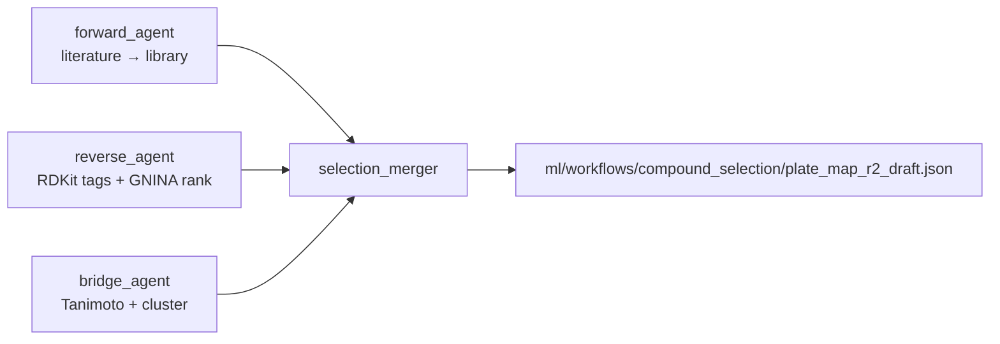

# β-Loop — Track A Project Plan

**Event:** 24hr AI for Science World Models Hack @ Zeon Systems  
**Track:** A — Close the Loop (TEM-1 β-Lactamase Inhibitor Screen)  
**Team size:** 3  
**Submit:** Sunday 2:30 PM · **Demo/Pitch:** Sunday 4:30 PM

**Teammate index:** [`data/README.md`](data/README.md) · **Storage policy:** [`data/STORAGE.md`](data/STORAGE.md)

---

## Contents

| Section | What it covers |
|---------|----------------|
| [Progress snapshot](#progress-snapshot-sat-1446) | Done / in progress / blocked |
| [Two main tasks](#two-main-tasks) | Robotics vs compound screening |
| [Compound list generation](#compound-list-generation-phase-a--phase-b) | Phase A inventory + Phase B ADK pipeline |
| [File contract](#file-contract-freeze-before-hackathon) | Schemas all layers share |
| [Assay validation](#assay-validation--prove-it-works-before-round-1) | Minimal plate before discovery |
| [Plate designs](#plate-designs) | R1 discovery vs R2 dose-response |
| [Phases 0–4](#phase-0-pre-hackathon-tonight-34-hours) | Hour-by-hour schedule |
| [Next actions](#next-actions-sat-1446) | Who does what now |

---

## Team

| Person | Role | Primary ownership |
|--------|------|-------------------|
| **Robotics** | Lab robotics | Zeon workflows, hardware booking, sim → bench execution |
| **You** | Hardware / bioengineer | Scientific QC, gate thresholds, integration glue, demo narrative |
| **ML** | **Philip** | Google ADK agent, literature search (open repos + optional Paperclip), analysis pipeline, in silico prioritization |

---

## North star

By demo time we show a real **data → decision → better result** story:

1. **Purified TEM-1** on-deck dilutions → **nitrocefin screen (Run 2)** → analyze → agent designs **next round** (visibly different plate)
2. IC50 on at least one true inhibitor (clavulanate / tazobactam / sulbactam class)
3. ADK agent loop with fixed file contract between layers
4. Paperclip-grounded prioritization — agent cites literature when picking compounds and designing dose-response follow-ups

**Plan change (Run 2):** Original north star included CFPS expression + GFP gate before screening. That path is **deferred** — Run 2 and current robotics use **commercial/lab purified TEM-1** via [`tem1_activity_screen`](mastermix/workflows/tem1_activity_screen.json). See [ASSAY_WORKFLOW.md](ASSAY_WORKFLOW.md).

**Scoring priorities (from brief):**
- Inhibit TEM-1 as much as possible
- Best result after **two rounds**, loop closed
- Round-1 data visibly changing Round-2 plate layout

---

## Progress snapshot (Sat ~14:46)

### Planning & docs

| Item | Status |
|------|--------|
| Repo scaffold (PLAN, ROLES, REQUIREMENTS, team folders) | ✓ |
| [`data/README.md`](data/README.md) — rounds vs versions, teammate index | ✓ |
| [`data/STORAGE.md`](data/STORAGE.md) — git vs local policy | ✓ |
| [`ASSAY_WORKFLOW.md`](ASSAY_WORKFLOW.md) — purified TEM-1 nitrocefin screen (Run 2 path) | ✓ |
| Philip selection plan | ✓ [COMPOUND_SELECTION.md](pvjthomas/COMPOUND_SELECTION.md) |
| Assay cheat sheet | ✓ [NITROCEFIN_ASSAY.md](pvjthomas/NITROCEFIN_ASSAY.md) |
| Automation split (Rob/Chang) | Draft — [learsch/](learsch/), [changhu/](changhu/) |

### Compound library & selection (Task 2)

| Item | Status |
|------|--------|
| **Phase A** — parse TargetMol → [`data/compounds.csv`](data/compounds.csv) (105 compounds) | ✓ |
| Phase A — heuristic tags (7 inhibitors, 97 substrates, T19709 exclude) | ✓ |
| [`data/compound_dossiers.json`](data/compound_dossiers.json) — 105 summaries | ✓ |
| **Phase B** — ADK forward / reverse / bridge pipeline | ✓ scaffold in [`ml/agent/`](ml/agent/) |
| [`data/reference_inhibitors.csv`](data/reference_inhibitors.csv) | ✓ seeded |
| [`ml/workflows/compound_selection/state.json`](ml/workflows/compound_selection/state.json) + draft plate | ✓ offline run |
| Forward literature batch searches | ✓ batch `.txt` in `data/compound_literature/` + `state.forward.literature_searches` (2026-07-25) |
| Reverse literature (open repos, v3 plate) | ✓ 23/23 IDs in `refs/` + `literature_search_cache.json` (2026-07-25) |
| Forward agent test suite (Tier 1–3) | ✓ 31 tests — clavulanate fixture → v3 screen subset (23) → full library (105); see [`ml/agent/tests/FORWARD_TEST_PLAN.md`](ml/agent/tests/FORWARD_TEST_PLAN.md) |
| **Forward agent live run + screening priors (Philip P0)** | **Partial** — forward ✓ · reverse lit ✓ · **next:** ChEMBL/manual curation for Tier-1 Ki/IC50 (T19860 is gold) |
| GNINA docking + `dock_score` column | Optional — pipeline built; Mac needs Docker or remote Linux (see [COMPOUND_SELECTION.md § R2 macOS](pvjthomas/COMPOUND_SELECTION.md#step-r2--docking-gnina)) |
| Promote draft → active `plate_map_r1.json` for discovery | ✗ needs sign-off |

### Plates & literature (Round 1)

| Item | Status |
|------|--------|
| **Active robot plate** — [`data/plate_map_r1.json`](data/plate_map_r1.json) | ✓ **v2 validation** (clavulanic + DMSO @ 50 µM) |
| Superseded discovery layout | [`data/screens/1/v1/`](data/screens/1/v1/) — 24-compound design (history) |
| T19860 literature + assay priors | ✓ [compound_literature/refs/T19860.json](data/compound_literature/refs/T19860.json) |
| [`data/literature_summary.json`](data/literature_summary.json) | ✓ priors + forward match metadata |

### Agent, analysis & robotics

| Item | Status |
|------|--------|
| ADK agent (Philip / ML) | ✓ [`ml/agent/`](ml/agent/) — coordinator + 6 sub-agents |
| Philip analysis helpers | ✓ [`ml/analysis/`](ml/analysis/) — kinetics + plate DR |
| Team `agent/` + `analysis/` at repo root | ✗ Consolidated under `ml/` |
| Python env + Paperclip | ✓ `.venv`, CLI + SDK |
| Zeon workflows | **Run 2:** `mastermix/workflows/tem1_activity_screen.json` ✓ · CFPS/GFP deferred |
| Run log timing parser + CI baselines | ✓ [`ml/analysis/run_log_timing.py`](ml/analysis/run_log_timing.py) |

**Current phase:** **Run 2** — purified TEM-1 activity screen executed on robot; kinetics analysis + agent loop in progress.

---

## What we are NOT doing

- Molecular dynamics / FEP (too slow, not needed for demo)
- Screening all 105 compounds in Round 1 (won't fit; not required)
- Letting file formats drift between rounds (breaks the loop)

---

## Two main tasks

Zeon provides a **skills library** — pre-built robotic primitives (e.g. `plateshaker_open`, `epipette_aspirate`, `platesealer_run`) and example workflows. Our job is to compose those into the full experiment and close the scientific loop. Everything else splits into **two workstreams**:

| # | Task | Status | Owner | Deliverable |
|---|------|--------|-------|-------------|
| **1** | **Program the assay on robotics** | **Run 2 workflow live** | Rob + Chang (+ pvjthomas QC) | `tem1_activity_screen` — dilutions + nitrocefin screen from **purified TEM-1** |
| **2** | **Compound screening (closed loop)** | In progress — Run 2 data landing | Philip (+ ML sign-off) | ADK: forward/reverse/bridge → plate → screen → analyze → next round |

**Plans:** [COMPOUND_SELECTION.md](pvjthomas/COMPOUND_SELECTION.md) · [ml/agent/README.md](ml/agent/README.md) · [ml/CLOSED_LOOP.md](ml/CLOSED_LOOP.md)

### Task 1 — Program the assay on robotics

Use the Zeon skills library to build and run the **nitrocefin inhibition screen** from **purified TEM-1** (Run 2 path):

1. **Prepare on deck** — dilute TEM-1 stock (100 ng/µL → 0.1 ng/µL working), compound/control working solutions, matched vehicle
2. **Load assay plate** — enzyme, compounds, plate mix, pre-incubation
3. **Start reaction** — just-in-time nitrocefin prep + dispense; kinetic A490 readout

Implemented workflow: [`mastermix/workflows/tem1_activity_screen.json`](mastermix/workflows/tem1_activity_screen.json). Run folder includes `timing_summary.json` and `nitrocefin_timing.json` via `save_run_folder`.

**Deferred (original plan):** CFPS expression (`cfps_mastermix`) + GFP gate — not on Run 2 critical path. See [ASSAY_WORKFLOW.md § Original plan](ASSAY_WORKFLOW.md#original-plan--cfps--gfp-gate-deferred).

**Open questions:** Pre-incubation time on hardware, nitrocefin prep overlap with pre-incubation, plate reader export format.

### Task 2 — Compound screening (closed loop)

Build the agent layer that decides **what to test** and learns from results:

1. **Before Round 1** — literature priors (open repos + ChEMBL), GNINA priors, plate layout for ~24 compounds
2. **After Round 1** — normalize kinetics, rank hits, agent designs Round 2 (dose-response + follow-ups)
3. **After Round 2** — IC50 on best inhibitors; demo the R1 → R2 pivot

Code lives in [`ml/agent/`](ml/agent/) and [`ml/analysis/`](ml/analysis/). File contract in [File contract](#file-contract-freeze-before-hackathon).

### How the two tasks connect

```
Task 1 (robotics)                    Task 2 (screening)
─────────────────                    ──────────────────
Purified TEM-1 on deck ──┐
tem1_activity_screen   ──┼── plate_map + run log ──► Screen Run 2
save_run_folder          │         │
                         │         ▼ kinetics_r2.csv + timing JSON
                         │    agent analyzes (median scoring)
                         │         │
                         │         ▼ plate_map_r3 / DR draft
                         └──── next screen round ──► IC50 + demo
```

Neither task stands alone for the hackathon score — judges want **both** a working robot assay **and** a visible closed loop on compound selection.

---

## Compound list generation (Phase A → Phase B)

How we built the library index and how the agent will refresh picks going forward.

### Phase A — library inventory (done)

One Python pass over the [TargetMol sheet](https://docs.google.com/spreadsheets/d/1b7UuzXu_auqoq2hFT81X3UuRutxxWxZW/edit?gid=372192752#gid=372192752):

1. Export CSV → [`data/compounds.csv`](data/compounds.csv) (105 rows, SMILES, plate/well)
2. Classify with rule stack: hard-coded 7 inhibitor IDs · exclude T19709 · else TargetMol `Receptor`/`Target` → `antibiotic_substrate`
3. Emit [`data/compound_dossiers.json`](data/compound_dossiers.json) with `functional_class` derived from tags

Manual v1 discovery plate (24 compounds + 12 controls) documented in [`data/screens/1/v1/`](data/screens/1/v1/) — **superseded** by validation-first approach.

### Phase B — ADK pipeline (scaffold done)

Three deterministic passes orchestrated by sub-agents in [`ml/agent/`](ml/agent/):



| Pass | Agent | Key tools | Writes |
|------|-------|-----------|--------|
| **Forward** | `forward_agent` | `seed_reference_inhibitors`, `match_literature_to_library`, Paperclip | `reference_inhibitors.csv`, `compound_literature/refs/{id}.json` |
| **Reverse** | `reverse_agent` | `classify_scaffolds_rdkit`, `run_gnina_batch` (stub), `rank_by_dock_score` | `selection/state.json`, optional CSV patch |
| **Bridge** | `bridge_agent` | `find_tanimoto_neighbors`, `cluster_library`, `assign_tier2_analogs` | `similarity/neighbors.json` |
| **Merge** | `selection_merger` | `merge_tier_assignments`, `generate_round2_plate_draft` | `selection/plate_map_r2_draft.json` |

**Run offline:** `run_compound_selection_pipeline()` — see [agent README](ml/agent/README.md).

**Promotion rule:** drafts under `ml/workflows/compound_selection/` require Philip sign-off before overwriting [`data/plate_map_r1.json`](data/plate_map_r1.json).

### Plate strategy (current)

| Stage | Round 1 version | Wells | Purpose |
|-------|-----------------|-------|---------|
| **Now (active)** | v2 `r1-validation-v2` | 8 | Clavulanic @ 50 µM + DMSO vehicle — assay QC |
| **Next** | v3+ or rediscover v1 | 36 | Full 24-compound discovery after validation passes |
| **Later** | R2 | DR layout | Agent-designed dose-response on R1 hits |

---

## System architecture

```
┌─────────────────────────────────────────────────────────┐
│  ML: Google ADK LoopAgent (max 2 iterations)            │
│  Tools: prioritize_compounds · analyze_kinetics ·       │
│         design_next_plate · search_literature (Paperclip)│
└───────────────┬────────────────────────────▲────────────┘
                │ plate_map_r{N}.json         │ kinetics_r{N}.csv
                ▼                             │ round_summary_r{N}.json
┌─────────────────────────────────────────────────────────┐
│  Robotics: Zeon protocol runner                         │
│  Workflow: tem1_activity_screen (purified TEM-1)        │
│  Deferred: cfps_mastermix · gfp_read                    │
└───────────────┬────────────────────────────▲────────────┘
                │ execution                   │ plate reader export
                ▼                             │
┌─────────────────────────────────────────────────────────┐
│  You: QC gates · compound metadata · handoffs · demo    │
└─────────────────────────────────────────────────────────┘
```

---

## File contract (freeze before hackathon)

All cross-layer data uses fixed schemas. **Do not change field names after Phase 0.**

| File | Direction | Owner | Purpose |
|------|-----------|-------|---------|
| `data/compounds.csv` | — | Philip | Full library metadata (Phase A) |
| `data/compound_dossiers.json` | — | Philip | Per-compound summaries for agent |
| `data/reference_inhibitors.csv` | — | Philip | Literature / ChEMBL gold set (Phase B forward) |
| `data/compound_literature/refs/{id}.json` | Paperclip → agent | Philip | Curated per-compound literature |
| `data/literature_summary.json` | Philip → agent | Philip | Structured priors + forward match metadata |
| `ml/workflows/compound_selection/state.json` | internal | Philip | Tier assignments from Phase B pipeline |
| `ml/workflows/compound_selection/plate_map_r2_draft.json` | draft → sign-off | Philip | Agent-generated R2 layout (not robot-active) |
| `ml/workflows/compound_selection/neighbors.json` | internal | Philip | Tanimoto neighbors (Phase B bridge) |
| `data/plate_map_r1.json` | out → robot | Philip | **Active** Round 1 plate (currently v2 validation) |
| `data/screens/{round}/{version}/` | archive | Philip | Superseded plate designs + rationale |
| `data/plate_map_r2.json` | out → robot | Agent | Round 2 well assignments |
| `data/kinetics_r1.csv` | robot → agent | Robotics | Raw A490 time course |
| `data/kinetics_r2.csv` | robot → agent | Robotics | Raw A490 time course |
| `data/round_summary_r1.json` | agent | Philip/ML | Ranked hits + rationale |
| `data/round_summary_r2.json` | agent → demo | Philip/ML | IC50 + final ranking |
| `data/compound_literature/*.txt` | Paperclip → agent | Philip | Raw batch search outputs (optional) |

### `compounds.csv` columns

```
compound_id,name,rack_id,well,scaffold_class,functional_class,tier,dock_score,exclude
```

- `scaffold_class`: `inhibitor` | `antibiotic_substrate` | `exclude` | `other_β_lactam` | `artifact_suspect` (_stub_)
- `functional_class`: _stub_ — `positive` | `negative` | `unknown` | `exclude` | `neutral` | `borderline` | `artifact` (see [Compound & plate classification](#compound--plate-classification-reference))
- `tier`: 1 = known inhibitor, 2 = GNINA top, 3 = diverse antibiotic
- `exclude`: true for nitrocefin (T19709) — assay substrate, not a test compound

### `plate_map_r{N}.json` shape

```json
{
  "round": 1,
  "assay_type": "single_point",
  "final_volume_ul": 50,
  "wells": {
    "A1": {"compound_id": "T19860", "concentration_uM": 50, "role": "pos-ctrl-clavaculin"},
    "A2": {"compound_id": null, "concentration_uM": 0, "role": "vehicle"},
    "A3": {"compound_id": null, "concentration_uM": 0, "role": "no_tem1"}
  }
}
```

### `round_summary_r{N}.json` shape

```json
{
  "round": 1,
  "hits": [{"compound_id": "T19860", "name": "Clavulanic Acid", "pct_inhibition": 87.2, "concentration_uM": 50}],
  "failed_wells": ["D4"],
  "agent_rationale": "Strong inhibition from clavulanate-class compounds. Substrates showed <10% inhibition. Round 2: 8-point DR on top 3 inhibitors.",
  "next_plate_design": "dose_response"
}
```

---

## Scientific plan

### Library facts (TargetMol β-Lactam Library)

- **105 compounds** in source plates (10 mM in DMSO, 50 µL) — see [`data/compounds.csv`](data/compounds.csv) and [library sheet](https://docs.google.com/spreadsheets/d/1b7UuzXu_auqoq2hFT81X3UuRutxxWxZW/edit?gid=372192752#gid=372192752)
- **Known inhibitors to prioritize:** clavulanic acid, clavulanate lithium, sulbactam, tazobactam, enmetazobactam
- **Most compounds are β-lactam antibiotics** (TEM-1 substrates, not inhibitors) — useful as negative controls
- **Exclude:** nitrocefin (T19709) — chromogenic substrate

### Assay logic

**Enzyme source (Run 2):** Purified TEM-1 diluted on-deck to 0.1 ng/µL; 20 µL per well → 2 ng TEM-1. No CFPS lysate on the critical path.

1. **Screen:** nitrocefin kinetics at A490; initial slope = enzyme velocity (aligned to per-well nitrocefin t0 when timing metadata available)
2. **Scoring:** normalize to vehicle (0% inhibition) and no-TEM-1 (100% inhibition)

```
pct_inhibition = 100 * (1 - (slope_sample - slope_no_tem1) / (slope_vehicle - slope_no_tem1))
```

**Control anchors (per plate):** use the **median** slope across replicate control wells — not the mean.

| Control | Typical reps | Anchor metric |
|---------|--------------|---------------|
| Vehicle (DMSO + TEM-1) | 3/3 | `median(slope_vehicle_wells)` → score 0 |
| No-TEM-1 | 3/3 | `median(slope_no_tem1_wells)` → score 100 |

**Per-well score:** plug each well’s slope (kinetic window 180–480 s, aligned per well to nitrocefin `t0` when timing metadata is available) into the formula above using those median control slopes.

**Compound call (triplicates):** score **each of 3/3** sample wells independently, then take the **median** of those three `pct_inhibition` values → one number per `compound_id`. Example: scores 88, 92, 12 → median **88**.

| Compound call | Rule (median of 3/3 well scores) |
|---------------|-------------------------------------|
| Hit | ≥ 50 |
| Borderline | 20 – 49 |
| No hit | < 20 |
| Failed compound | ≥ 2/3 reps bad (score outside 0–150 or bad curve) |

Pos ctrl QC (clavulanic T19860): same formula on **3/3** pos ctrl wells → median must be ≥ 50 before sample calls.

Canonical decision tree: [`pvjthomas/runs/2/v5/run2_decision_tree.md`](pvjthomas/runs/2/v5/run2_decision_tree.md).

- **Hit threshold (Round 1):** median ≥ 50% inhibition at 50 µM (3/3 reps)
- **Round 2:** 8-point dose-response on top inhibitors (3 µM → 100 µM log scale)

### In silico stack (ML, pre-hackathon)

| Tool | Use | Skip |
|------|-----|------|
| RDKit substructure tags | β-lactam / inhibitor scaffold class | — |
| GNINA docking vs TEM-1 (PDB 1JQL) | Rank untested compounds | — |
| **Paperclip** (`gxl-paperclip` / CLI / MCP) | TEM-1 inhibitor literature, assay conditions, IC50 priors | — |
| DiffDock | Optional pose viz for slides | If time-tight |
| MD / FEP | — | Always |

---

## Literature search

The agent searches **open biomedical repositories by default** (Europe PMC, PubMed, ChEMBL, Semantic Scholar, OpenAlex) via [`ml/agent/tools/literature_repositories.py`](ml/agent/tools/literature_repositories.py). **[Paperclip](https://paperclip.gxl.ai/)** (GXL) remains available for optional full-text map when open-repo abstracts lack Ki/IC50 or nitrocefin assay detail.

**Why this stack fits the project:** The compound library is mostly β-lactam antibiotics (substrates) with a few true inhibitors (clavulanate, sulbactam, tazobactam). Open repos + ChEMBL give structured Ki/IC50 without map quota; Paperclip supplements full-text extraction when needed — directly matching the hackathon brief's "before the experiment" agent tasks.

### Install (ML person, Phase 0)

**Open repositories** — no install beyond Python stdlib; optional API keys improve rate limits (see [REQUIREMENTS.md](REQUIREMENTS.md)).

**Paperclip** (optional supplement) — run in **your terminal** (sign-in opens a browser):

```bash
curl -fsSL https://paperclip.gxl.ai/install.sh | bash
paperclip config   # verify auth
pip install -r requirements.txt   # includes gxl-paperclip
export PAPERCLIP_API_KEY="pk_..." # or use paperclip login credentials
```

**Cursor fallback (no CLI):** MCP server `https://paperclip.gxl.ai/mcp`

Full setup details: `REQUIREMENTS.md`

### When literature search runs in our loop

| When | Who | Action |
|------|-----|--------|
| **Phase 0 (tonight)** | Philip | Batch searches → `data/compound_literature/` (repos or Paperclip) |
| **Phase 0 (tonight)** | Philip | Summarize into `data/literature_summary.json` | ✓ |
| **Before Round 1** | ADK agent | `reverse_literature_check()` + `search_chembl_activities()` — per-compound priors |
| **Before Round 1** | ADK agent | `load_literature_summary()` — fast priors without live API |
| **After Round 1** | ADK agent | Optional: lookup analogs / IC50 priors for R2 dose-response design |
| **Demo / pitch** | You | Cite one literature finding that shaped Round 1 plate (e.g. "known inhibitors at 50 µM") |

### Phase 0 search queries (run tonight)

**Preferred — agent / Python (open repos):**

```python
from agent.tools.literature import search_literature, search_chembl_activities, save_literature_search

save_literature_search(
    "TEM-1 beta-lactamase inhibitor clavulanate sulbactam tazobactam",
    source="europe_pmc",
    limit=20,
    filename="tem1_inhibitors.txt",
)
save_literature_search("nitrocefin beta-lactamase assay IC50 kinetic", source="europe_pmc", limit=10)
search_chembl_activities("clavulanic acid", target_query="TEM-1")
```

**Optional Paperclip CLI** — save each output to `data/compound_literature/`:

```bash
paperclip search "TEM-1 beta-lactamase inhibitor clavulanate sulbactam tazobactam" -n 20 \
  > data/compound_literature/tem1_inhibitors_paperclip.txt

paperclip map --from s_<result_id> \
  "What IC50 values and pre-incubation times were used for TEM-1 inhibitors in nitrocefin assays?" \
  > data/compound_literature/ic50_synthesis.txt
```

### `literature_summary.json` (agent reads this)

```json
{
  "known_inhibitors": ["clavulanic acid", "sulbactam", "tazobactam", "enmetazobactam"],
  "expected_substrates_low_inhibition": ["ampicillin", "cephalexin", "penicillins", "cephalosporins"],
  "assay_notes": {
    "typical_screen_conc_uM": 50,
    "pre_incubation_min": 10,
    "read_wavelength_nm": 490,
    "metric": "initial slope A490 vs time"
  },
  "sources": ["data/compound_literature/tem1_inhibitors.txt"]
}
```

ML writes this after literature searches; agent loads it in `prioritize_compounds()` and `design_next_plate()`.

### ADK integration

Register as function tools on the decision-making `LlmAgent`:

| Tool | Backend | Purpose |
|------|---------|---------|
| `search_literature(query, source=...)` | Open repos + optional Paperclip | Live search during agent reasoning |
| `search_chembl_activities(compound_name)` | ChEMBL REST API | Structured Ki/IC50 vs TEM-1 |
| `reverse_literature_check(...)` | Open repos (default) | Per-compound priors → `refs/{id}.json` |
| `map_literature_results(...)` | Paperclip only | Full-text Ki/IC50 extraction from `s_*` searches |
| `load_literature_summary()` | reads `data/literature_summary.json` | Fast priors without API call |
| `list_literature_sources()` | — | List all registered backends |

Implementation: [`ml/agent/tools/literature.py`](ml/agent/tools/literature.py), [`literature_repositories.py`](ml/agent/tools/literature_repositories.py), [`reverse.py`](ml/agent/tools/reverse.py).

### Literature in the demo (30 sec)

> "Before touching the robot, our agent searched Europe PMC, ChEMBL, and PubMed — and identified clavulanate-class compounds as true inhibitors vs. β-lactam antibiotics as substrates — so the Run 2 plate deliberately mixed both. Kinetic data confirms literature priors; the agent uses hits to design the next dose-response plate."

---

## Assay validation — prove it works before Round 1

**Antibiotics are not required to validate TEM-1 activity.** The nitrocefin assay only needs enzyme + substrate + controls. See [pvjthomas/NITROCEFIN_ASSAY.md](pvjthomas/NITROCEFIN_ASSAY.md).

### What each proof demonstrates

| Check | Wells | Pass criterion |
|-------|-------|----------------|
| **Enzyme active** | Vehicle (purified TEM-1 + DMSO + nitrocefin) | Strong, linear A490 slope |
| **Signal is enzymatic** | No-TEM-1 (no TEM-1 + nitrocefin) | Slope ≈ background (flat) |
| **Inhibition detectable** | Clavulanic acid T19860 @ 50 µM + enzyme | Slope << vehicle (≥50% inhibition) |

If vehicle is flat → purified enzyme dilution or nitrocefin problem. If clavulanate doesn’t inhibit → assay conditions wrong. **Do not run library screens until all three nitrocefin checks pass.**

*(Deferred upstream check: GFP gate on CFPS plate — not required for Run 2.)*

### Minimal validation plate (run first — ~10 wells)

Use before committing a full Round 1 plate. Can be a corner of the same 96-well plate or a dedicated short run.

| Well(s) | Role | compound_id | Expected |
|---------|------|-------------|----------|
| 4× | **Vehicle** | — (DMSO matched) | Max slope |
| 2× | **No-TEM-1** | — | Min slope |
| 2× | **Positive control** | T19860 Clavulanic Acid @ 50 µM | Strong inhibition |
| 2× | *optional* | T1005 Ampicillin @ 50 µM | Low inhibition (substrate demo — **not required for pass**) |

**Pass gate:** Philip signs off → Chang may run full Round 1 discovery.

**Active on robot:** [`data/plate_map_r1.json`](data/plate_map_r1.json) — Round 1 **v2** (`r1-validation-v2`, 8 wells: clavulanic @ 50 µM + DMSO). Full 24-compound discovery layout archived at [`data/screens/1/v1/`](data/screens/1/v1/).

---

## Library: inhibitors vs antibiotics

The [TargetMol library](https://docs.google.com/spreadsheets/d/1b7UuzXu_auqoq2hFT81X3UuRutxxWxZW/edit?gid=372192752#gid=372192752) (`data/compounds.csv`) is **mostly β-lactam antibiotics** (~97), not inhibitor hits.

### What is clavulanate?

**Clavulanic acid (clavulanate)** is a β-lactam **β-lactamase inhibitor** — it inactivates TEM-1 (suicide inhibitor), restoring penicillins in combo therapy (e.g. amoxicillin + clavulanate). In-library: **T19860**, **T14979**.

### Two compound classes in the library

| Class | Mechanism vs TEM-1 | Nitrocefin assay | Examples in library |
|-------|-------------------|------------------|---------------------|
| **β-lactamase inhibitor** | Blocks enzyme | **High % inhibition** | Clavulanate, sulbactam, tazobactam, enmetazobactam |
| **β-lactam antibiotic** | **Substrate** — TEM-1 hydrolyzes it | **Low % inhibition** (usually) | Ampicillin, cephalexin, meropenem, ceftazidime, … |

### Why include antibiotics in Round 1 (but not validation)?

| Question | Answer |
|----------|--------|
| Need antibiotics to prove assay works? | **No** — vehicle + no-TEM-1 + clavulanate is enough |
| Include antibiotics in Round 1? | **Yes, ~8 as substrate controls** — shows assay discriminates inhibitor vs substrate |
| Hunt for inhibitors among antibiotics? | **No** — prioritize Tier 1 inhibitors; antibiotics are intentional negatives |

---

## Compound & plate classification (reference)

Canonical vocabulary for plate design, `data/compounds.csv`, and `plate_map_r*.json`.  
**Status:** stubs — fill as selection and R1 data land. Full selection rationale: [pvjthomas/COMPOUND_SELECTION.md](pvjthomas/COMPOUND_SELECTION.md).

### Plate controls

Wells that are **not library compounds** (or library compounds used only as fixed controls).  
Maps to `plate_map` field: `role`.

| `role` | Enzyme? | Compound | Expected A490 slope | # wells (typical) | Purpose | Notes |
|--------|---------|----------|---------------------|-------------------|---------|-------|
| `vehicle` | ✓ | DMSO matched | **Max** | 4–6 | Normalization reference | _TBD: exact DMSO %_ |
| `no_tem1` | ✗ | DMSO or sample matched | **Min** | 2–4 | Background / non-enzymatic | _TBD_ |
| `pos-ctrl-clavaculin` | ✓ | Clavulanate T19860 @ 50 µM | **Low** | 1–2 | Prove inhibition detectable | _TBD: backup positive (sulbactam?)_ |
| `validation_substrate` | ✓ | e.g. Ampicillin T1005 @ 50 µM | **High** (like vehicle) | 0–2 | Optional substrate demo | Validation plate only |
| _stub_ | | | | | | |

**Minimal validation plate:** `vehicle`, `no_tem1`, `pos-ctrl-clavaculin`, optional `validation_substrate`.  
**Round 1 / R2:** `vehicle`, `no_tem1`, `pos-ctrl-clavaculin` on every screen plate.

### Library compound classes

Classification of **test compounds** from the TargetMol library.  
Maps to `data/compounds.csv` field: `scaffold_class`.

| `scaffold_class` | Count (approx) | Mechanism vs TEM-1 | Expected @ 50 µM | Selection tier | Example IDs | Notes |
|------------------|----------------|--------------------|------------------|----------------|-------------|-------|
| `inhibitor` | 7 | Blocks β-lactamase | **≥50% inhibition** | Tier 1 | T19860, T1262, T6685, … | _TBD: refine sultamicillin_ |
| `antibiotic_substrate` | ~97 | Hydrolyzed as substrate | **<20% inhibition** | Tier 4 | T1005, T1008, T0224, … | Intentional negatives in R1 |
| `exclude` | 1 | Assay substrate | Do not test | — | T19709 | Nitrocefin |
| `other_β_lactam` | _TBD_ | _TBD_ | _TBD_ | Tier 3? | _TBD_ | e.g. 7-ACA, intermediates |
| `artifact_suspect` | _TBD_ | Assay interferer | _TBD_ | Filter out | _TBD_ | PAINS, quenchers — _stub list_ |
| _stub_ | | | | | | |

**TODO:** Phase B RDKit pass in pipeline · manual edge-case review · merge `dock_score` when GNINA runs.

### Suggested mapping — unified functional classes

Single vocabulary linking **biology → selection → expected outcome → R2 action**.  
Maps to optional field: `functional_class` (add to `compounds.csv` / `plate_map` when ready).

| `functional_class` | Maps from | Expected R1 result | Round 1 use | Round 2 action | Examples |
|----------------------|-----------|--------------------|--------------|--------------------|----------|
| **positive** | `inhibitor`, Tier 1–2 | Hit (≥50% @ 50 µM) | Must test | 8-point dose-response | Clavulanate, tazobactam |
| **negative** | `antibiotic_substrate`, Tier 4 | No hit (<20%) | Substrate controls | Drop unless surprise | Ampicillin, cephalexin |
| **unknown** | Tier 3, `other_β_lactam` | Uncertain | Explore / dock picks | Retest if borderline | _TBD compound list_ |
| **exclude** | `exclude`, nitrocefin | N/A | Never plate | — | T19709 |
| **neutral** | — (not a library class) | Max activity | **Plate control only** (`vehicle`) | — | DMSO, no compound |
| **borderline** | _from R1 data_ | 20–50% @ 50 µM | _TBD_ | Retest or DR | _TBD after R1_ |
| **artifact** | `artifact_suspect`, failed QC | Uninterpretable | Drop | Drop | _TBD_ |
| _stub_ | | | | | |

**Outcome after R1** (post-hoc labels — _stub_):

| Post-R1 label | Criteria | Next step |
|---------------|----------|-----------|
| `confirmed_hit` | ≥50% + inhibitor class or DR confirms | IC50 in R2 |
| `confirmed_substrate` | <20% + antibiotic class | Document; drop |
| `surprise_hit` | ≥50% + antibiotic class | _TBD: investigate_ |
| `surprise_miss` | <20% + inhibitor class | Assay debug |
| `failed_well` | Bad kinetics / outlier | Exclude from analysis |
| _stub_ | | |

**TODO:** Lock field names in file contract · encode in `plate_map_r*.json` · agent uses `functional_class` in rationale.

---

## Plate designs

### Round 1 — Validation (active: v2)

| Wells | Content | Notes |
|-------|---------|-------|
| 4 | Vehicle (DMSO) | Normalization |
| 2 | No-TEM-1 | Background |
| 2 | Clavulanic acid T19860 @ 50 µM | Positive control |

**File:** [`data/plate_map_r1.json`](data/plate_map_r1.json) · **Literature:** [T19860.json](data/compound_literature/refs/T19860.json) (Ki 0.85 µM → 50 µM screen conc)

### Round 1 — Discovery (deferred until validation passes)

Superseded v1 design: [`data/screens/1/v1/plate_map.json`](data/screens/1/v1/plate_map.json) · Draft from Phase B pipeline: [`ml/workflows/compound_selection/plate_map_r2_draft.json`](ml/workflows/compound_selection/plate_map_r2_draft.json)

| Wells | Content |
|-------|---------|
| 6 | Vehicle (DMSO-matched) |
| 4 | No-TEM-1 |
| 2 | Clavulanic acid @ 50 µM (on-plate positive) |
| 24 | Agent-selected compounds @ 50 µM |
| *remaining* | Empty or reserved |

**Round 1 compound selection (24 wells):**

| Bucket | Count | Examples |
|--------|-------|----------|
| Known inhibitors (Paperclip priors) | 4 | Clavulanic acid, sulbactam, tazobactam, enmetazobactam |
| GNINA top scores | 8 | Highest dock score, not yet tested |
| Diverse antibiotics (Paperclip: expect substrates) | 8 | Ampicillin, cephalexin, meropenem, etc. (expect low inhibition) |
| Structural analogs | 4 | Neighbors of inhibitor scaffolds |

### Round 2 — Characterization (agent-designed from R1)

| Wells | Content |
|-------|---------|
| 6 | Vehicle |
| 4 | No-TEM-1 |
| 24 | Clavulanate 8-point DR (3 → 100 µM) |
| 24 | Sulbactam 8-point DR |
| 24 | Tazobactam 8-point DR |
| ~8 | Follow-up singles / retests |

**Agent pivot example (what judges want to see):**

> Clavulanic acid: 87% @ 50 µM. Sulbactam: 72%. Ampicillin: 8% (substrate — drop).  
> Round 2: 8-point dose-response for top 3 inhibitors; no more broad singles.

If R1 assay fails (all flat): fallback R2 runs known inhibitors + clavulanate DR anyway.

---

## Robot workflows (Task 1)

Part of **Task 1: Program the assay on robotics**. Composed from the Zeon skills library.

### Active — Run 2 (`tem1_activity_screen`)

| Workflow | Input | Output | Status |
|----------|-------|--------|--------|
| [`tem1_activity_screen`](mastermix/workflows/tem1_activity_screen.json) | Purified TEM-1 stock, compound library, nitrocefin stock, BLB | Assay plate + run log + timing artifacts | **Implemented — Run 2 executed** |

**Workflow steps (Run 2):**
1. Prepare dilutions (TEM-1 + compound/control working solutions)
2. Dispense TEM-1, no-enzyme BLB, vehicle, compounds to assay plate
3. Whole-plate shaker mix + pre-incubation
4. Prepare nitrocefin working solution just-in-time; dispense by condition
5. `save_run_folder` — log, `timing_summary.json`, `nitrocefin_timing.json`

**Controls on every screen plate:** vehicle (max velocity) + no-TEM-1 (background).

### Deferred — original CFPS → GFP plan

| # | Workflow | Input | Output | Status |
|---|----------|-------|--------|--------|
| 1 | `cfps_mastermix` | DNA templates (hand-loaded) | Sealed CFPS plate → incubator | Implemented in repo; **not Run 2 path** |
| 2 | `gfp_read` | CFPS plate | Fluorescence → gate pass/fail | Planned only |

---

## Phase 0: Pre-hackathon (tonight, ~3–4 hours)

### Philip (compound selection + agent)

- [x] Parse compound library → `data/compounds.csv` + heuristic tags
- [x] `data/compound_dossiers.json` — 105 summaries
- [x] `data/literature_summary.json` — hardcoded priors + forward metadata
- [x] T19860 Paperclip curation → `data/compound_literature/refs/T19860.json`
- [x] Phase B ADK scaffold → `ml/agent/` (forward / reverse / bridge / merger)
- [x] Offline pipeline run → `ml/workflows/compound_selection/state.json`, draft plate, `similarity/neighbors.json`
- [x] `data/reference_inhibitors.csv` seeded
- [x] Validation plate v2 → active `data/plate_map_r1.json`
- [x] Discovery v1 archived → `data/screens/1/v1/`
- [x] Paperclip batch searches → `data/compound_literature/*.txt` (tem1_inhibitors_nitrocefin.txt, clavulanate_class_inhibitors.txt; 2026-07-25)
- [x] Forward agent test suite — Tier 1–2 (clavulanate fixture), Tier 2.5 (v3 screen subset), Tier 3 (105-compound pipeline + timing); 31 tests in `ml/agent/tests/`
- [x] **P0 — Run forward agent live** — Paperclip batch + match + finalize v1 on full library (2026-07-25)
- [x] Phase B pipeline (reverse → bridge → merge) → refreshed `state.json` + `plate_map_r2_draft.json` (2026-07-25)
- [ ] **P0 — Screening priors for every compound on the discovery plate** — Philip documents **recommended screen concentration (µM)**, **expected inhibition at that conc**, and **saved literature evidence** (PMID/DOI, Ki/IC50, assay conditions) in `data/compound_literature/refs/{id}.json` + `data/literature_summary.json` → `compound_assay_priors` (T19860 is the template; T1262, T1631/T6685, T14081, T14979 still thin)
- [ ] Forward Tier 4 Paperclip integration in CI/nightly (`test_paperclip_clavulanic.py` — manual baseline recorded)
- [ ] GNINA batch dock → `gnina_cnn_affinity` in `compound_dossiers.json` (Mac: Docker CPU or remote Linux — [Step R2 macOS](pvjthomas/COMPOUND_SELECTION.md#step-r2--docking-gnina))
- [ ] Promote `selection/plate_map_r2_draft.json` → `data/plate_map_r2.json` after validation + sign-off
- [x] Analysis helpers → `ml/analysis/` (kinetics + plate DR)
- [x] ML workspace consolidated → `ml/` (agent + analysis + workflows)

### ML (Philip)

- [x] ADK coordinator + Phase B pipeline → `ml/agent/`
- [x] Analysis helpers → `ml/analysis/`
- [x] ML workspace + closed-loop plan → [ml/CLOSED_LOOP.md](ml/CLOSED_LOOP.md)
- [ ] Synthetic kinetics fixture + unit test on fake CSV
- [x] **`ml/analysis/kinetics.py` — median scoring:** median control slopes (3/3 vehicle, 3/3 no-TEM-1); score each sample well; compound call = median of 3/3 well scores per `compound_id`; Q1/Q2/Q3 gates — see [Scientific plan — Scoring](#assay-logic) and [`test_kinetics.py`](ml/agent/tests/unit/test_kinetics.py)
- [ ] **Validate median scoring on real Run 2 CSV** — compare compound medians to manual decision-tree calls
- [ ] **Emit `data/assay/run_2_summary.json`** — per-compound `median_pct_inhibition`, post-hoc labels, QC gate pass/fail
- [ ] **ADK `analyze_kinetics()`** — surface compound-level medians + labels in agent round summary
- [ ] Optional ADK `LoopAgent` wrapper (max 2 iterations)

### Robotics
- [x] **`tem1_activity_screen`** workflow — dilutions + nitrocefin screen from purified TEM-1
- [x] Run log timing auto-summary in `save_run_folder`
- [ ] Plate reader kinetic export integrated with Run 2
- [ ] Document expected timing per workflow (see [`ml/analysis/RUN_LOG_TIMING.md`](ml/analysis/RUN_LOG_TIMING.md))
- [ ] *(Deferred)* CFPS + GFP gate workflows on hardware

### You (pvjthomas)
- [x] Plan change documented — purified TEM-1 path in ASSAY_WORKFLOW + PLAN
- [ ] Kickoff question list — updated for Run 2 (pre-incubation, reader export)
- [x] Define hit threshold and normalization formula (documented in [Scientific plan](#scientific-plan); median scoring in `ml/analysis/kinetics.py` + unit tests)
- [ ] Validate median scoring on Run 2 `kinetics_r2.csv` vs [run2 decision tree](pvjthomas/runs/2/v5/run2_decision_tree.md)
- [ ] Draft 3-min demo script (purified enzyme path)
- [ ] Set up shared status board (bookings, gates, file paths)
- [x] Compound selection plan + assay cheat sheet
- [x] Run 2 plate layout + decision tree

### All (15-min sync)
- [x] Agree file schemas above (documented; encode in JSON as artifacts land)
- [x] Validation plate v2 active on robot (`plate_map_r1.json`)
- [x] Full discovery list drafted (v1 archived; Phase B draft available)
- [ ] Assign Phase 1 booking priorities

---

## Phase 1: Saturday — Run 2 screen (actual path)

| Time | Robotics | ML | You |
|------|----------|-----|-----|
| Setup | Stage purified TEM-1, nitrocefin, compound library, BLB on deck | Confirm Run 2 plate map + priors | QC deck layout vs world |
| Run | **`tem1_activity_screen` on hardware** (~3 h robot time per run log) | Monitor `timing_summary.json`; prep kinetics pipeline | QC run log / timing stagger |
| Post-run | `save_run_folder` artifacts to cloud | **`analyze_kinetics()` on `kinetics_r2.csv`** | Verify vehicle / no-TEM-1 / clavulanate QC |
| Analysis | — | **`round_summary` + agent next plate** | Sign off hits vs [run2 decision tree](pvjthomas/runs/2/v5/run2_decision_tree.md) |

**Critical path (Run 2):** Nitrocefin validation checks on plate reader data — **no GFP gate**.  
**Critical path (selection):** Median scoring + timing QC (Q1T) before calling compounds.

*(Original Phase 1 schedule — CFPS block → GFP gate → screen — superseded; see [ASSAY_WORKFLOW.md](ASSAY_WORKFLOW.md).)*

---

## Phase 2: Analysis & next-round design

| Time | Robotics | ML | You |
|------|----------|-----|-----|
| Post Run 2 | — | **`analyze_kinetics()` → round summary** | Verify clavulanate shows inhibition |
| Sync | — | **Agent emits next `plate_map` + rationale** | **Team sync — sign off next round** |
| Prep | Prep next reagents/plate if block available | Hit heatmap / timing QC | Document screen → next-round diff for demo |

**Target:** Analysis turnaround **< 20 minutes** after reader export.

---

## Phase 3: Follow-up screen / dose-response

| Time | Robotics | ML | You |
|------|----------|-----|-----|
| Next block | **Run agent-designed plate** (DR or follow-up) | IC50 fitting code ready | QC curves live |
| Analysis | Buffer / optional fixes | `round_summary_r2.json`, IC50 table | Pick hero compound for pitch |
| Polish | Workflow timing improvements | Demo dashboard | Pitch slides / script |

---

## Phase 4: Sunday — polish & demo (hours 12–24)

| Time | All |
|------|-----|
| 08:00–12:00 | Optional: confirmatory replicate if block available |
| 12:00–14:00 | Record demo video (loop + robot clip + IC50 plot) |
| 14:00–14:30 | **Final submission** |
| 14:30–16:30 | Live demo + **3-min pitch** |

---

## Hardware booking plan

Testbed booked in **60-min blocks** (Run 2 screen ~3 h — may need chained blocks).

| Priority | Block | Owner | Notes |
|----------|-------|-------|-------|
| P0 | **Run 2 screen** (`tem1_activity_screen`) | Robotics | Purified TEM-1; reader after run |
| P0 | Plate reader kinetic read | Robotics / You | Export → `kinetics_r2.csv` |
| P1 | Confirmatory / next-round screen | Robotics | Agent-designed plate |
| P2 | *(Deferred)* CFPS + GFP | Robotics | Original plan only |

**While robot runs:** ML analyzes prior runs · You QC timing/kinetics · Robotics preps next plate map.

---

## Kickoff questions (Run 2 — still open)

1. Pre-incubation time on hardware (workflow default 10 min vs 2 min observed in one run log)
2. Nitrocefin working solution prep — overlap with pre-incubation vs substrate stability
3. Plate reader export format / API for kinetic data (`kinetics_r2.csv`)
4. DMSO concentration matched in all vehicle and compound wells?
5. When / whether to re-enable CFPS + GFP for demo narrative

*(Original kickoff Qs about GFP reader and CFPS incubation — relevant only if CFPS path returns.)*

---

## Deliverables checklist

### MVP (must ship)
- [x] **Run 2 screen on hardware** (`tem1_activity_screen`, purified TEM-1)
- [ ] Kinetics analysis + QC gates (vehicle, no-TEM-1, clavulanate)
- [ ] Written agent rationale for screen → next-round pivot (Paperclip priors + Run 2 data)
- [ ] IC50 or dose-response on ≥ 1 known inhibitor
- [ ] Demo showing closed loop (plate map diff + kinetics)
- [x] Paperclip literature summary used in compound selection

### Stretch
- [x] Agent generates next-round plate map (draft — `ml/workflows/compound_selection/plate_map_r2_draft.json`)
- [ ] Live agent loop during demo
- [ ] GNINA pose visualization
- [x] Substrate vs inhibitor auto-classification (Phase A rules + Phase B RDKit tags)
- [ ] *(Deferred)* CFPS + GFP gate for full expression narrative

---

## Demo script (3 minutes)

1. **Problem** (15 s): AMR rising; TEM-1 destroys β-lactams before they work
2. **System** (30 s): ADK agent + Paperclip literature + Zeon robot + plate reader closed loop
3. **Run 2 screen** (45 s): Purified TEM-1 on-deck → 9 compounds + controls → nitrocefin kinetics → ranked hits; substrates vs inhibitors
4. **The loop** (45 s): Agent reads data → next plate **visibly different** → show rationale
5. **Result** (30 s): IC50 / inhibition on clavulanate / tazobactam class; loop closed
6. **Next** (15 s): Scale library; optional return to CFPS expression path for cost/demo

---

## Risk register

| Risk | Likelihood | Mitigation | Owner |
|------|------------|------------|-------|
| Purified TEM-1 stock degraded / wrong conc | Medium | On-deck dilution QC; vehicle slope gate | You |
| Nitrocefin stagger skews kinetics | Medium | `nitrocefin_timing.json` + Q1T gate; batch dispense improvement | ML |
| R2 all flat (assay fail) | Medium | Debug enzyme/nitrocefin/DMSO; re-run with clavulanate controls | You |
| Agent too slow to trust | Low | Hardcode plate; agent drives next round only | ML |
| 60-min block too tight for full screen | Medium | Run 2 ~3 h — chain blocks; pre-sim | Robotics |
| File format drift | Low | Freeze schemas Phase 0 | ML |
| Nitrocefin in compound list | Low | Exclude T19709 in `compounds.csv` | ML |
| Paperclip auth fails on-site | Low | Per-compound refs + hardcoded priors already shipped | Philip |
| *(Deferred)* GFP reader / CFPS incubation | — | Not on Run 2 path | — |

---

## Communication

- **Standup:** every 2 hours, 5 min (booking status, gates, blockers)
- **Critical sync:** after Run 2 kinetics land — lock next plate map
- **Single source of truth:** this doc + shared booking calendar + `data/` folder

---

## Repo structure (current)

```
zeon_hack/
├── PLAN.md                     ← this file
├── REQUIREMENTS.md
├── data/
│   ├── README.md               ← rounds vs versions index
│   ├── STORAGE.md              ← git vs local policy
│   ├── compounds.csv           ← Phase A library (105 compounds)
│   ├── compound_dossiers.json
│   ├── reference_inhibitors.csv
│   ├── literature_summary.json
│   ├── compound_literature/refs/        ← per-compound Paperclip curation
│   ├── selection/              ← Phase B pipeline outputs (drafts)
│   ├── similarity/neighbors.json
│   ├── plate_map_r1.json       ← ACTIVE: v2 validation (8 wells)
│   ├── runs/1/v1/              ← archived discovery layout (24 compounds)
│   └── plate_map_r2.json       ← (pending R1 results)
├── ml/
│   ├── agent/                  ← ADK coordinator + Phase B sub-agents
│   ├── analysis/               ← kinetics, run_log_timing, timing_baselines
│   └── workflows/compound_selection/
├── mastermix/workflows/        ← tem1_activity_screen (Run 2), cfps_mastermix (deferred)
├── pvjthomas/                  ← bio QC, Run 2 decision tree, assay docs
│   └── runs/2/v5/              ← run2_decision_tree.md
└── ml/CLOSED_LOOP.md
```

---

## Next actions (Sat ~16:15)

### Philip — P0 (blocks discovery plate sign-off)

**Running the forward agent is top priority.** Before promoting the v3 discovery plate or sharing it with Chang, every compound on the screen must have documented priors — not just a name on a plate map.

| Deliverable | Where it lives | Status |
|-------------|----------------|--------|
| **Run forward agent live** | `ml/workflows/compound_selection/state.json` + `snapshots/forward/v1/` | ✓ 2026-07-25 |
| **Reverse literature (open repos)** | `refs/{id}.json` + `literature_search_cache.json` | ✓ 23/23 v3 plate IDs · Ki extraction mostly T19860 only |
| **Screen concentration per compound** | `refs/{id}.json` → `assay_recommendations.tem1_nitrocefin.screen_conc_uM` | T19860 @ 50 µM ✓ · others `project_default` |
| **Literature evidence (PMID, Ki/IC50, methods)** | `refs/{id}.json` → `entries[]` | T19860 gold ✓ · Tier-1 inhibitors need ChEMBL/manual curation |
| **Agent-facing priors summary** | `data/literature_summary.json` → `compound_assay_priors` | 23/23 IDs @ 50 µM · expand Ki/rationale |
| **Human rationale** | `pvjthomas/runs/1/v3/selection_rationale.md` | Draft ✓ · update after priors land |

**Commands:**

```bash
cd ml/agent && PYTHONPATH=. python3 -c "
from agent.tools.reverse import reverse_literature_check
from agent.tools.literature import search_chembl_activities

# Re-run per-compound search (open repos; cached when search_version matches)
print(reverse_literature_check(compound_ids=None, tiers=[1,2,3,4], use_cache=True))

# Structured Ki/IC50 for Tier-1 inhibitors
for name in ['clavulanic acid', 'sulbactam', 'tazobactam', 'enmetazobactam']:
    print(search_chembl_activities(name, target_query='TEM-1'))
"
```

Then **manually curate** Tier-1 inhibitor refs to T19860 quality (ChEMBL activities + optional Paperclip map → Ki/IC50 → `screen_conc_uM` rationale).

### Everyone else

| Who | Task | Status |
|-----|------|--------|
| Rob + Chang | **Run 2** `tem1_activity_screen` on hardware | ✓ executed (see run log) |
| Rob + Chang / You | Plate reader export → `kinetics_r2.csv` | In progress |
| Philip | Run 2 QC sign-off (vehicle, no-TEM-1, clavulanate) | Waiting on reader data |
| Philip | Median kinetics vs [run2 decision tree](pvjthomas/runs/2/v5/run2_decision_tree.md) | After CSV |
| Philip | Promote next-round plate after QC + priors | Blocked on kinetics |
| Philip (ML) | Timing regression baselines in CI | ✓ [`ml/analysis/timing_baselines/`](ml/analysis/timing_baselines/) |
| *(Deferred)* Rob | CFPS + GFP on hardware | Not Run 2 path |

---

*Last updated: 2026-07-26 — aligned with purified TEM-1 / Run 2 path ([ASSAY_WORKFLOW.md](ASSAY_WORKFLOW.md))*
