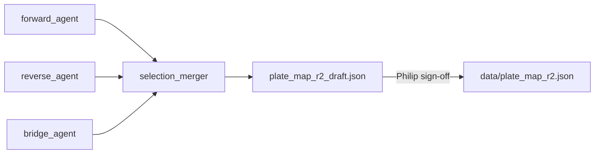

# Compound selection workflow (Phase B)

Philip's ADK pipeline workspace: forward → reverse → bridge → merger → draft plate.

**Not** a physical screen round — only the **promoted plate** crosses into shared `data/` (`plate_map_r2.json`, `data/screens/`). Round 1 was a simple 2-compound validation plate (`data/plate_map_r1.json`).

**Agent code:** [`../../agent/README.md`](../../agent/README.md) · **Strategy:** [`../../COMPOUND_SELECTION.md`](../../COMPOUND_SELECTION.md)

## Pipeline (mermaid)



## Layout

```
workflows/compound_selection/
  state.json                    # live pipeline state (forward/reverse/bridge/merge)
  plate_map_r2_draft.json       # merger output — NOT for robot until sign-off
  plate_map_r2_draft.png        # wellmap visualization of draft
  neighbors.json                # Tanimoto neighbors (bridge pass)
  snapshots/
    forward/
      v1/                       # frozen forward_agent run
        manifest.json
        state_forward.json
        reference_inhibitors.csv
        literature_summary_patch.json
        refs/
```

Future agent snapshots: `snapshots/reverse/v1/`, `snapshots/bridge/v1/`.

## Active vs frozen

| Purpose | Path |
|---------|------|
| Live pipeline state | `state.json` |
| Draft plate (pre sign-off) | `plate_map_r2_draft.json` |
| Frozen forward_agent v1 | `snapshots/forward/v1/` |
| Team curated outputs (shared) | `data/reference_inhibitors.csv`, `data/compound_literature/refs/` |
| Robot-active Round 1 plate | `data/plate_map_r1.json` |
| Robot-active Round 2 plate (after sign-off) | `data/plate_map_r2.json` |

Run `finalize_forward_run(version=1)` after a forward pass to freeze a snapshot under `snapshots/forward/v1/`.

## Run offline

```bash
cd /path/to/zeon_hack
source .venv/bin/activate
python -c "
import sys; sys.path.insert(0, 'pvjthomas')
from agent.tools.selection import run_compound_selection_pipeline
print(run_compound_selection_pipeline())
"
```

Or via ADK: `adk run ml/agent` → "Run compound selection pipeline without live literature searches."

**Reverse literature (per compound):**

```bash
cd ml/agent && PYTHONPATH=. python3 -c "
from agent.tools.reverse import reverse_literature_check
print(reverse_literature_check(tiers=[1,2,3,4], use_cache=True))
"
```

Default backends: Europe PMC, PubMed, ChEMBL, Semantic Scholar, OpenAlex.

**Promote to robot:** copy draft → `data/plate_map_r2.json` and snapshot → `data/screens/{round}/v{N}/` only after pvjthomas approval.
