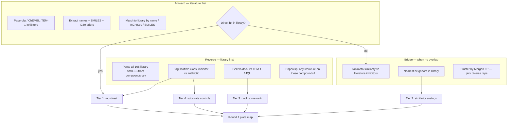

# Compound selection plan — Philip

**Owner:** Philip (pvjthomas) · **Task 2:** Compound screening (prioritization + closed-loop design)  
**Outputs:** `data/compounds.csv`, `data/literature_summary.json`, `data/plate_map_r1.json`, `ml/workflows/compound_selection/*`, agent priors for R2

**Implementation:** Phase A (inventory) done · Phase B ADK pipeline in [`agent/`](agent/README.md) · Active robot plate is **validation v2** (not full discovery)

This library is unusual: **105 β-lactam** compounds from TargetMol — mostly **antibiotics (TEM-1 substrates)** plus a few **true β-lactamase inhibitors**. Selection is not “dock everything and hope”; it is **find inhibitors, confirm substrates as controls, and bridge gaps with similarity when literature and library don’t overlap**.

---

## Compound library (source of truth)

**Google Sheet:** [TargetMol Beta-Lactam Compound Library-A](https://docs.google.com/spreadsheets/d/1b7UuzXu_auqoq2hFT81X3UuRutxxWxZW/edit?gid=372192752#gid=372192752)

**Local copy:** [`data/compounds.csv`](../data/compounds.csv) — parsed from sheet gid `372192752` (Index, Plate, Row, Col, SMILES, etc.)

| Stat | Value |
|------|-------|
| Total compounds | **105** |
| Source plates | PHD215176 (80), PHD215177 (22), PHD215178 (3) |
| Stock | 10 mM in DMSO, 50 µL per well |
| **Tier 1 inhibitors (pre-tagged)** | **7** |
| **Exclude from screening** | **1** (nitrocefin T19709 — assay substrate) |
| Antibiotic / substrate (pre-tagged) | ~97 |

### Tier 1 — β-lactamase inhibitors in library

| compound_id | name | plate | well |
|-------------|------|-------|------|
| T19860 | Clavulanic Acid | PHD215176 | h2 |
| T14979 | Clavulanate lithium | PHD215176 | g6 |
| T6685 | Sulbactam sodium | PHD215176 | f2 |
| T1631 | Sulbactam | PHD215177 | a10 |
| T1262 | Tazobactam | PHD215176 | b10 |
| T14081 | Enmetazobactam | PHD215176 | f7 |
| T13038 | Sultamicillin | PHD215177 | b10 |

### Exclude — do not screen

| compound_id | name | reason |
|-------------|------|--------|
| T19709 | Nitrocefin | Chromogenic **assay substrate** (yellow → red with TEM-1) |

### Rob / Chang: source plate lookup

Compound transfers use **plate + row + col** from `data/compounds.csv` (columns `plate`, `row`, `col`). Example: clavulanic acid = `PHD215176`, row `h`, col `2`.

---

## Clavulanate vs antibiotics (read this first)

### What is clavulanate?

**Clavulanic acid (clavulanate)** is a β-lactamase **inhibitor**, not a standalone antibiotic. It binds/inactivates TEM-1 so penicillins can work (e.g. Augmentin = amoxicillin + clavulanate). In our library: **T19860**, **T14979**.

### Are antibiotics in the library?

**Yes — ~97 of 105 compounds are β-lactam antibiotics** (penicillins, cephalosporins, carbapenems). TEM-1 **hydrolyzes** them as **substrates**; they usually do **not** inhibit nitrocefin cleavage.

### Do we need antibiotics to prove the assay works?

**No.**

| To validate assay | Required? | Wells |
|-------------------|-----------|-------|
| TEM-1 + nitrocefin + vehicle | **Yes** | Max activity |
| No-TEM-1 control | **Yes** | Background |
| Clavulanate positive | **Yes** | Inhibition works |
| Antibiotic (e.g. ampicillin) | **No** | Optional demo only |

Run the **minimal validation plate** (below) before Round 1. Antibiotics enter at **Round 1 selection** as substrate controls, not for assay QC.

---

## Minimal validation plate (before Round 1)

Philip sign-off required before Chang runs discovery screen. See also [NITROCEFIN_ASSAY.md](NITROCEFIN_ASSAY.md).

| Well(s) | Role | compound_id | Pass if… |
|---------|------|-------------|----------|
| 4× | Vehicle | — | Strong A490 slope |
| 2× | No-TEM-1 | — | Flat / background |
| 2× | Positive | T19860 @ 50 µM | ≥50% inhibition vs vehicle |
| 2× | Optional substrate demo | T1005 Ampicillin @ 50 µM | Low inhibition (not required to pass) |

**If clavulanate fails but vehicle works → fix assay (DMSO, conc, pre-incubation), not compound selection.**

---

## Compound & plate classification (reference)

Canonical vocabulary for plate design, `data/compounds.csv`, and `plate_map_r*.json`.  
**Status:** stubs — fill as selection and R1 data land.

### Plate controls

Wells that are **not library compounds** (or are library compounds used only as fixed controls).  
Maps to `plate_map` field: `role`.

| `role` | Enzyme? | Compound | Expected A490 slope | # wells (typical) | Purpose | Notes |
|--------|---------|----------|---------------------|-------------------|---------|-------|
| `vehicle` | ✓ | DMSO matched | **Max** | 4–6 | Normalization reference | _TBD: exact DMSO %_ |
| `no_tem1` | ✗ | DMSO or sample matched | **Min** | 2–4 | Background / non-enzymatic | _TBD_ |
| `pos-ctrl-clavaculin` | ✓ | Clavulanate T19860 @ 50 µM | **Low** | 1–2 | Prove inhibition detectable | _TBD: backup positive (sulbactam?)_ |
| `validation_substrate` | ✓ | e.g. Ampicillin T1005 @ 50 µM | **High** (like vehicle) | 0–2 | Optional substrate demo | Validation plate only |
| _stub_ | | | | | | |

**Minimal validation plate** uses: `vehicle`, `no_tem1`, `pos-ctrl-clavaculin`, optional `validation_substrate`.  
**Round 1 / R2** require: `vehicle`, `no_tem1`, `pos-ctrl-clavaculin` on every screen plate.

---

### Library compound classes

Classification of **test compounds** from the TargetMol library.  
Maps to `data/compounds.csv` field: `scaffold_class`.

| `scaffold_class` | Count (approx) | Mechanism vs TEM-1 | Expected @ 50 µM | Selection tier | Example IDs | Notes |
|------------------|----------------|--------------------|------------------|----------------|-------------|-------|
| `inhibitor` | 7 | Blocks β-lactamase | **≥50% inhibition** | Tier 1 | T19860, T1262, T6685, … | _TBD: refine sultamicillin_ |
| `antibiotic_substrate` | ~97 | Hydrolyzed as substrate | **<20% inhibition** | Tier 4 | T1005, T1008, T0224, … | Intentional negatives in R1 |
| `exclude` | 1 | Assay substrate | Do not test | — | T19709 | Nitrocefin |
| `other_β_lactam` | _TBD_ | _TBD_ | _TBD_ | Tier 3? | _TBD_ | e.g. 7-ACA, intermediates |
| `artifact_suspect` | _TBD_ | Assay interferer | _TBD_ | Filter out | _TBD_ | PAINS, quenchers — _stub list_ |
| _stub_ | | | | | | |

**TODO:** Phase B RDKit pass done in pipeline · manual edge-case review · merge `dock_score` when GNINA runs.

---

### Suggested mapping — unified functional classes

Single vocabulary linking **biology → selection → expected outcome → R2 action**.  
Maps to optional field: `functional_class` (add to `compounds.csv` / `plate_map` when ready).

| `functional_class` | Maps from | Expected R1 result | Round 1 use | Round 2 action | Examples |
|----------------------|-----------|--------------------|--------------|--------------------|----------|
| **positive** | `inhibitor`, Tier 1–2 | Hit (≥50% @ 50 µM) | Must test | 8-point dose-response | Clavulanate, tazobactam |
| **negative** | `antibiotic_substrate`, Tier 4 | No hit (<20%) | Substrate controls | Drop unless surprise | Ampicillin, cephalexin |
| **unknown** | Tier 3, `other_β_lactam` | Uncertain | Explore / dock picks | Retest if borderline | _TBD compound list_ |
| **exclude** | `exclude`, nitrocefin | N/A | Never plate | — | T19709 |
| **neutral** | — (not a library class) | Max activity | **Plate control only** (`vehicle`) | — | DMSO, no compound |
| **borderline** | _from R1 data_ | 20–50% @ 50 µM | _TBD_ | Retest or DR | _TBD after R1_ |
| **artifact** | `artifact_suspect`, failed QC | Uninterpretable | Drop | Drop | _TBD_ |
| _stub_ | | | | | |

**Outcome after R1** (post-hoc labels — _stub_):

| Post-R1 label | Criteria | Next step |
|---------------|----------|-----------|
| `confirmed_hit` | ≥50% + inhibitor class or DR confirms | IC50 in R2 |
| `confirmed_substrate` | <20% + antibiotic class | Document; drop |
| `surprise_hit` | ≥50% + antibiotic class | _TBD: investigate_ |
| `surprise_miss` | <20% + inhibitor class | Assay debug |
| `failed_well` | Bad kinetics / outlier | Exclude from analysis |
| _stub_ | | |

**TODO:** Philip + ML agree on field names · encode in `plate_map_r*.json` · agent uses `functional_class` in rationale.

---

## Goal

Build a **defensible Round 1 plate (~24 compounds)** and **rules for Round 2** such that:

1. We **enrich for real inhibitors** (clavulanate-class) if they exist in-library
2. We **expect negatives** (antibiotic substrates) and use them to validate the assay story
3. We can **explain every well** to judges: literature, structure, similarity, or docking
4. R1 data **changes** R2 in a visible way (hits → dose-response; substrates → drop)

---

## Strategy overview: forward + reverse + bridge



---

## Phase 0 — Data prep (do first)

### 0.1 Library inventory

- [x] Parse TargetMol sheet → `data/compounds.csv` ([source sheet](https://docs.google.com/spreadsheets/d/1b7UuzXu_auqoq2hFT81X3UuRutxxWxZW/edit?gid=372192752#gid=372192752))
- [ ] Review / refine `scaffold_class` tags (RDKit SMARTS + manual)
- [ ] Add `dock_score` column after GNINA batch
- [ ] Columns in CSV: `compound_id`, `name`, `smiles`, `plate`, `row`, `col`, `scaffold_class`, `tier`, `exclude`
- [x] **Exclude:** nitrocefin (T19709)
- [x] SMILES included from sheet (verify salts / protonation with RDKit if docking odd)

**Tier 1 inhibitor IDs (confirmed in-library):**

| compound_id | name |
|-------------|------|
| T19860 | Clavulanic Acid |
| T14979 | Clavulanate lithium |
| T6685 | Sulbactam sodium |
| T1631 | Sulbactam |
| T1262 | Tazobactam |
| T14081 | Enmetazobactam |
| T13038 | Sultamicillin (ampicillin/sulbactam prodrug) |

### 0.2 Reference set — “gold” inhibitors from literature

Build `data/reference_inhibitors.csv` (may extend beyond library):

| Source | What to pull |
|--------|----------------|
| **Paperclip** | TEM-1 / class A β-lactamase inhibitors, nitrocefin IC50 |
| **ChEMBL** (via Paperclip SQL or web) | Target = TEM-1, activity type IC50/Ki |
| **Manual seed** | Clavulanate, sulbactam, tazobactam, avibactam (if mentioned) |

Columns: `name`, `smiles`, `ic50_uM`, `assay`, `source`, `pmid_or_chembl_id`

---

## Forward direction — literature → library

**Question:** *Which published inhibitors do we already have on the shelf?*

### Step F1 — Literature search (Paperclip)

Run and save under `data/compound_literature/`:

```bash
paperclip search "TEM-1 beta-lactamase inhibitor IC50 nitrocefin" -n 30
paperclip search "clavulanic acid sulbactam tazobactam beta-lactamase inhibitor" -n 20
paperclip map --from s_<id> "List compound names, SMILES if given, and IC50 values for TEM-1 inhibitors"
```

Optional: Paperclip → ChEMBL/PDB for structured affinities.

### Step F2 — Normalize hits

From papers, extract:

- Common names (clavulanic acid, sulbactam, …)
- SMILES or InChI if available
- Activity (IC50, % inhibition at X µM)
- Mechanism note (suicide inhibitor vs substrate)

Write `data/literature_summary.json` (see [PLAN.md](../PLAN.md)).

### Step F3 — Match literature → library

For each literature inhibitor, try in order:

1. **Exact name match** (case-insensitive, strip salts: “sodium”, “hydrate”)
2. **Synonym match** (PubChem synonyms for library compound names)
3. **SMILES / InChIKey exact match** (RDKit canonical SMILES)
4. **Tanimoto ≥ 0.85** to library compound → “probable same compound, different salt/name”

Record in `data/compounds.csv`:

- `literature_match`: yes / no / analog
- `literature_ref`: source id
- `tier`: 1 if direct literature inhibitor in library

### Step F4 — Interpret forward results

| Outcome | Action |
|---------|--------|
| **Hits found** (clavulanate-class in library) | Tier 1 must-test; use as **on-plate positive controls** @ 50 µM |
| **Partial overlap** | Direct hits Tier 1; literature-only structures → **bridge** (below) |
| **No overlap** | Rely on reverse + similarity; literature still informs assay conc and IC50 expectations |

**Expected for this library:** forward search **will** hit clavulanate/sulbactam/tazobactam — that validates the pipeline.

### Step F5 — Screening priors (Philip P0, blocks plate sign-off)

**Running the forward agent is top priority.** Offline tests and the **live forward pass** (2026-07-25) prove the pipeline; Philip’s curation is what makes every well on the discovery plate defensible to judges and Chang.

For **each compound on the Round 1 screen** (especially Tier-1 inhibitors + positive controls), Philip must deliver:

| Field | Location | Example (T19860) |
|-------|----------|------------------|
| **Screen concentration (µM)** | `refs/{id}.json` → `assay_recommendations.tem1_nitrocefin.screen_conc_uM` | 50 µM |
| **Rationale for that conc** | same block → `screen_rationale` | ~60× above Ki → expect strong inhibition |
| **Expected outcome @ screen conc** | `literature_summary.json` → `compound_assay_priors.{id}.expected_at_50uM` | `>=50% inhibition` |
| **Literature Ki/IC50 + assay** | `refs/{id}.json` → `entries[]` with PMID/DOI | Ki = 0.85 µM, nitrocefin, Radojković 2025 |
| **Saved evidence** | `pvjthomas/local/literature/{id}/` (gitignored raw) + structured ref in git | PMC12274840 full-text |

**Gold template:** [`data/compound_literature/refs/T19860.json`](../data/compound_literature/refs/T19860.json)

**Still needed (stubs today):** T1262, T14081, T1631/T6685 — forward match ✓ but no PMID-backed entries or `assay_recommendations` yet.

**Workflow:**

1. **Run forward agent** — seed → Paperclip → match → finalize v1 (see [PLAN.md](../PLAN.md) next actions). ✓ Done 2026-07-25.
2. **Paperclip map/full-text** per forward hit — extract Ki/IC50, enzyme conc, nitrocefin conc, buffer/pH.
3. **Pick screen concentration** — default project conc **50 µM** unless literature or solubility dictates otherwise; document multiplier vs Ki.
4. **Write ref JSON + patch `literature_summary.json`** — one canonical ref per inhibitor group (Case A alternates get thin pointers).
5. **Update `pvjthomas/runs/1/v3/selection_rationale.md`** — cite priors per well before Philip sign-off.

**Gate:** Do not promote `data/screens/1/v3/` → active `data/plate_map_r1.json` until Tier-1 inhibitor priors are at T19860 quality.

---

## Reverse direction — library → literature / mechanism

**Question:** *What is each library compound, and could it inhibit TEM-1 even if never published as an inhibitor?*

### Step R1 — Scaffold classification (RDKit)

Tag every library SMILES:

| Class | Substructure / rule | Expected nitrocefin assay |
|-------|---------------------|---------------------------|
| **inhibitor** | Clavulanate / penicillanic acid warhead + minimal side chain; sulbactam/tazobactam scaffolds | High % inhibition |
| **antibiotic_substrate** | Penicillin / cephalosporin / carbapenem (full acyl side chains) | Low inhibition (hydrolyzed as substrate) |
| **other_β_lactam** | 7-ACA, 7-ADCA, nitrocefin-like | Manual review |
| **exclude** | Nitrocefin | Do not test |

Use SMARTS patterns + manual override for edge cases. Store in `scaffold_class`.

### Step R2 — Docking (GNINA)

- Receptor: **TEM-1** (PDB **1JQL** or prepped structure)
- Dock all non-excluded library compounds
- Score with CNN affinity; keep top poses for demo slides

**Interpretation:**

- High GNINA score on **inhibitor-class** → reinforces Tier 1
- High score on **antibiotic** → suspect (may bind but as substrate); don’t over-prioritize for “inhibition”
- Use docking to **rank Tier 3** unknowns, not to override clavulanate priors

### Step R3 — Reverse literature check

For each **Tier 1 / Tier 2** candidate, quick Paperclip grep:

```bash
paperclip search "<compound name> beta-lactamase" -n 5
```

Ask: published as inhibitor, substrate, or not tested?

Update `compounds.csv` with `literature_support`: strong / weak / none / substrate_expected.

---

## Bridge — Tanimoto similarity (when forward ≠ library)

**Question:** *Literature has inhibitor X; we don’t have X. What in our library is closest?*

### Step B1 — Fingerprints

- **Morgan fingerprint** (radius 2, 2048 bits), RDKit
- **Tanimoto coefficient** between each library compound and each reference inhibitor SMILES

### Step B2 — Rules

| Tanimoto to nearest reference inhibitor | Label | Round 1 use |
|----------------------------------------|-------|-------------|
| ≥ 0.85 | Probable analog | Strong candidate |
| 0.70 – 0.85 | Scaffold neighbor | Include 2–4 diverse clusters |
| 0.50 – 0.70 | Weak analog | Optional wildcard |
| < 0.50 | Unrelated | Rank by docking or substrate control bucket |

Also compute **internal** library similarity:

- Cluster all 105 compounds (Butina or hierarchical, Tanimoto > 0.7)
- Pick **one representative per cluster** for diversity in Round 1

### Step B3 — When literature has no inhibitor overlap at all

Still valuable:

1. Tier 1 = RDKit **inhibitor-class** tags in library (if any beyond clavulanate)
2. Tier 3 = GNINA top 8 not yet in Tier 1
3. Tier 4 = 8 diverse **antibiotic_substrate** controls (expect low inhibition — proves assay discriminates)
4. Document: “No literature overlap; selection by scaffold + docking + diversity”

---

## What else to do (beyond forward / reverse / Tanimoto)

### 1. Assay-interference filters

Before putting a compound on the plate:

- [ ] **GFP fusion:** compound doesn’t quench A490 or fluoresce at 490 nm (flag from literature or structural alert)
- [ ] **Aggregation:** PAINS / colloidal aggregators (RDKit filters)
- [ ] **Reactive electrophiles** unrelated to β-lactam mechanism — may give false positives
- [ ] **DMSO solubility:** source is 10 mM in DMSO; final DMSO must match vehicle wells

### 2. Mechanism-aware expectations

| Mechanism | Examples in library | What to expect |
|-----------|---------------------|----------------|
| Suicide / covalent inhibitor | Clavulanate, sulbactam, tazobactam | Strong inhibition; pre-incubation helps |
| Substrate (competitive) | Ampicillin, cephalexin, meropenem | Weak or no nitrocefin inhibition |
| Slow-binding | Some boronic acids (if any) | Time-dependent — note if kinetics weird |

Use **substrate-class antibiotics as intentional negatives** in R1 — judges love “we predicted no inhibition and were right.”

### 3. Concentration strategy

- **Round 1 single-point:** 50 µM final (matches brief / HTS convention)
- Working solution = 10× (500 µM) given 5 µL into 50 µL assay
- **Round 2 dose-response:** 8-point log scale 3 – 100 µM on Tier 1 hits only
- Literature IC50 priors in `literature_summary.json` — compare after R1

### 4. Confidence tiers → Round 1 plate (24 wells)

| Bucket | Count | Selection rule |
|--------|-------|----------------|
| **Tier 1 — must test** | 4 | Known inhibitors (forward + reverse agree) |
| **Tier 2 — analogs** | 4 | Tanimoto ≥ 0.70 to Tier 1 scaffolds, diverse clusters |
| **Tier 3 — docking** | 8 | GNINA top among non-Tier-1 |
| **Tier 4 — substrate controls** | 8 | Diverse antibiotic_substrate (expect <10% inhibition) |

Plus on-plate controls (vehicle, no-TEM-1, clavulanate duplicate) — see [PLAN.md](../PLAN.md).

### 5. Round 2 decision rules (for agent / Philip sign-off)

After R1 kinetics:

| R1 result | R2 action |
|-----------|-----------|
| ≥50% inhibition @ 50 µM | 8-point dose-response |
| 20–50% | Retest single-point @ 10 µM or add to DR if scarce hits |
| <20% + substrate class | Drop; document as substrate control confirmed |
| Tier 1 fails but assay works | Assay debug — clavulanate must inhibit or fix protocol |

Also: Tanimoto neighbors of **confirmed R1 hits** → add to R2 singles if wells allow.

### 6. Enrichment metric (for pitch)

> “Forward search identified N literature inhibitors; M were in-library (M/N). Round 1 tested 24 compounds; hit rate among Tier 1 was X% vs Y% among substrate controls.”

Shows the selection plan **worked**, even if total hits are few.

### 7. Optional stretch (time permitting)

- **Boltz-2 / affinity** on top 10 — compare to GNINA
- **3D similarity** (shape) if 2D Tanimoto ambiguous
- ~~**ADK tool** `prioritize_compounds()` wrapping this pipeline~~ → **Done:** `run_compound_selection_pipeline()` in [`agent/tools/selection.py`](agent/tools/selection.py)

---

## Phase B — ADK implementation (done)

The forward / reverse / bridge strategy above is implemented as deterministic tools + sub-agents:

| Sub-agent | Tools | Output |
|-----------|-------|--------|
| `forward_agent` | `seed_reference_inhibitors`, `match_literature_to_library` | `reference_inhibitors.csv`, `compound_literature/refs/*.json` |
| `reverse_agent` | `classify_scaffolds_rdkit`, `run_gnina_batch` (stub), `rank_by_dock_score` | `selection/state.json` |
| `bridge_agent` | `find_tanimoto_neighbors`, `cluster_library`, `assign_tier2_analogs` | `similarity/neighbors.json` |
| `selection_merger` | `merge_tier_assignments`, `generate_round1_plate_draft` | `selection/plate_map_r1_draft.json` |

**Run offline:** see [`agent/README.md`](agent/README.md).  
**Promotion:** draft plate does not overwrite active `data/plate_map_r1.json` without Philip sign-off.

---

## Deliverables checklist

| File | Description | Status |
|------|-------------|--------|
| `data/compounds.csv` | Full library + tags, tiers | ✓ Phase A |
| `data/compound_dossiers.json` | Per-compound summaries | ✓ |
| `data/reference_inhibitors.csv` | Literature / ChEMBL gold set | ✓ seeded |
| `data/compound_literature/refs/*.json` | Per-compound Paperclip curation + **screen conc priors** | Partial — **T19860 gold**; T1262/T14081/T1631/T6685 stubs need PMID evidence |
| `data/compound_literature/*.txt` | Raw Paperclip batch outputs | Optional |
| `data/literature_summary.json` | Structured priors for agent | ✓ |
| `ml/workflows/compound_selection/plate_map_r1_draft.json` | Agent-generated 24-compound layout | ✓ draft |
| `data/plate_map_r1.json` | **Active** robot plate | ✓ v2 validation (8 wells) |
| `data/screens/1/v1/` | Archived v1 discovery + rationale | ✓ superseded |
| `pvjthomas/runs/1/v1/selection_rationale.md` | Human-readable well picks | ✓ v1 |

---

## Execution order (Philip)

**Top priority:** run forward agent + document screen concentrations and literature evidence (Step F5) before promoting the discovery plate.

1. [x] Parse library SMILES → `data/compounds.csv` (Phase A)
2. [x] Forward: seed `reference_inhibitors.csv` + match literature → library (offline)
3. [x] Match literature → library (exact + Tanimoto; T19860 curated via Paperclip)
4. [x] Forward agent test suite (Tier 1–3) — see [`ml/agent/tests/FORWARD_TEST_PLAN.md`](../ml/agent/tests/FORWARD_TEST_PLAN.md)
5. [ ] **Run forward agent live** — Paperclip searches → match → finalize v1 snapshot ← **P0**
6. [ ] **Screening priors for discovery plate** — concentration + saved literature evidence per compound (T19860 template) ← **P0**
7. [x] Reverse: RDKit scaffold tags (`classify_scaffolds_rdkit`)
8. [ ] Reverse: GNINA dock → `dock_score` column (stub only; defer until forward priors done)
9. [x] Bridge: Tanimoto neighbors + Tier 2 analog assignment
10. [x] Merge tiers → `ml/workflows/compound_selection/plate_map_r1_draft.json` (24 compounds)
11. [x] Validation plate v2 → active `data/plate_map_r1.json`
12. [ ] Promote discovery v3 plate (`data/screens/1/v3/`) after validation passes + **Step F5 complete** + Philip sign-off
13. [ ] Share full discovery plate with Chang for screen workflow

---

## Open questions (confirm at kickoff)

- Full SMILES list available from TargetMol sheet or need PubChem lookup?
- Final assay uses CFPS lysate directly — any compounds incompatible with lysate?
- Max DMSO % in assay wells?

---

## Related docs

- [PLAN.md](../PLAN.md) — progress snapshot, Phase A→B, plate layouts, two-round loop
- [agent/README.md](agent/README.md) — ADK pipeline usage
- [REQUIREMENTS.md](../REQUIREMENTS.md) — Paperclip, RDKit, GNINA setup
- [ROLES.md](../ROLES.md) — Philip sign-off on R2 plate map
