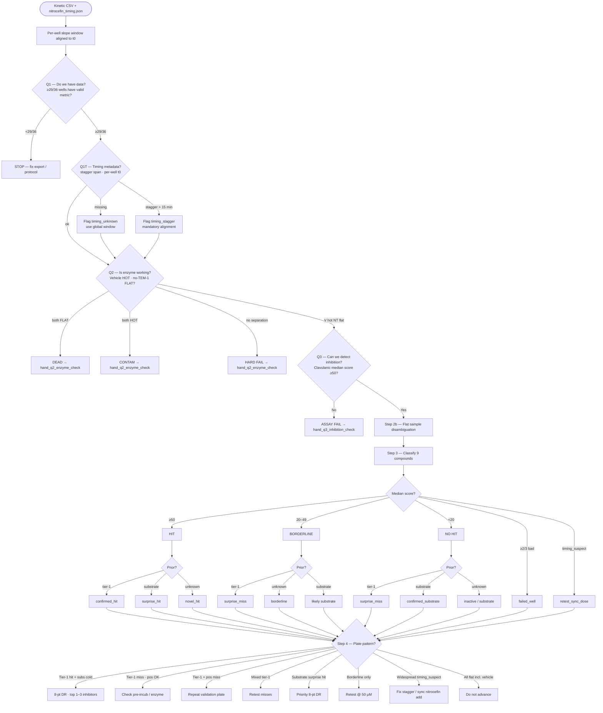
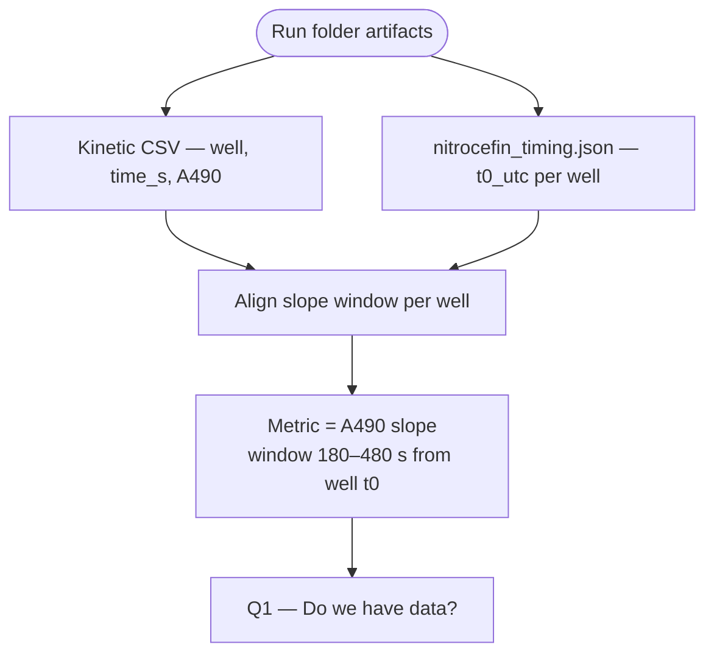
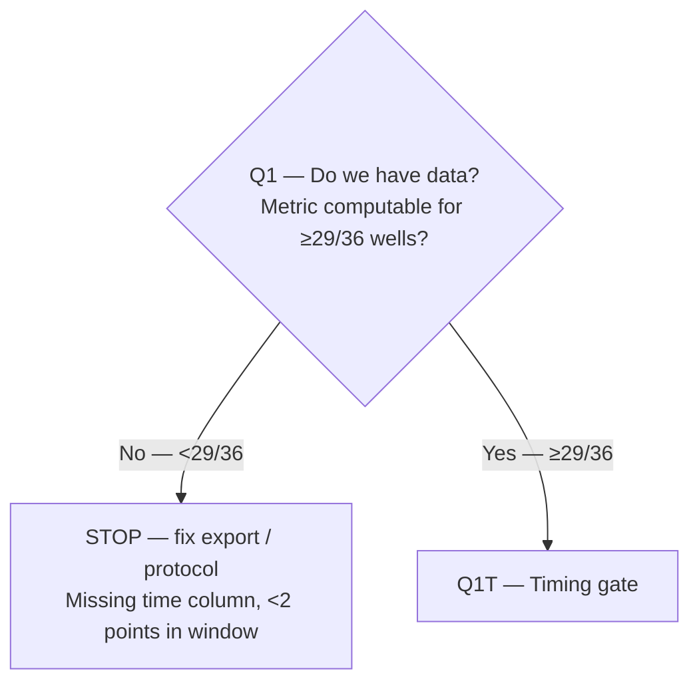
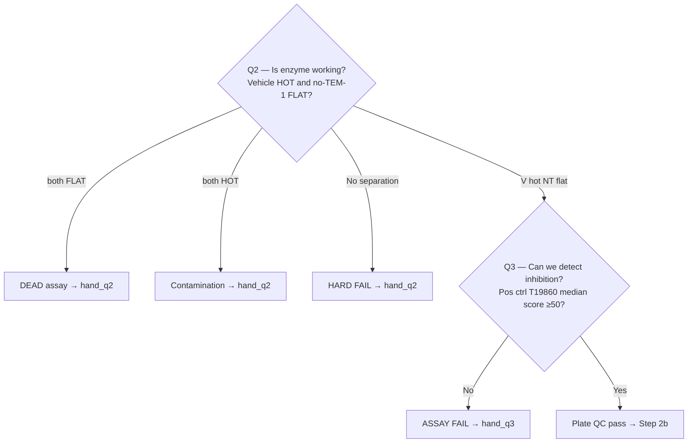
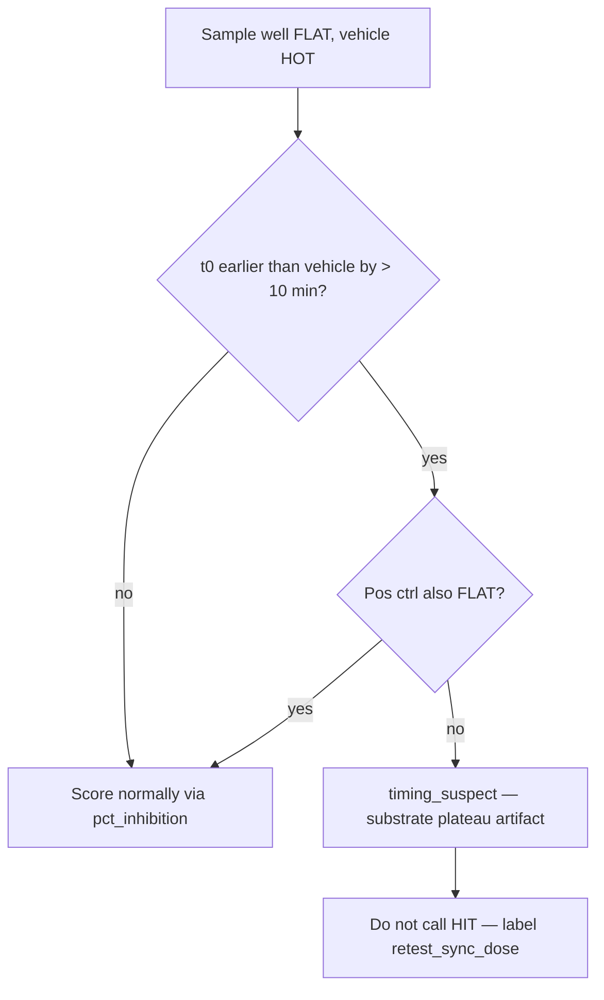
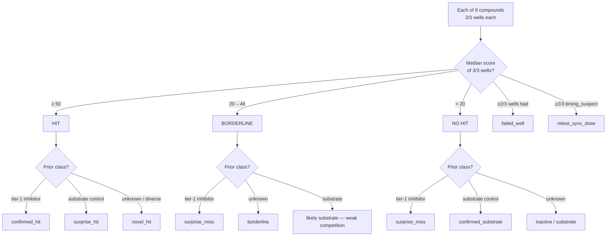
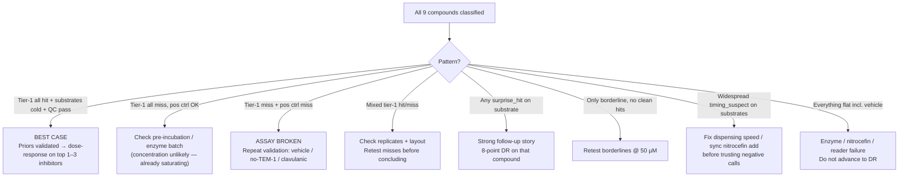

# Run 2 v5 — experiment decision tree

**Round:** 2 · **Version:** 5 (`r2-discovery-v5`)  
**Plate map:** [`data/screens/2/v5/plate_map.json`](../../../../data/screens/2/v5/plate_map.json)  
**Kinetic schedule:** [`kinetic_schedule.json`](kinetic_schedule.json) · [`pvjthomas/output/kinetic_schedule_r2_v5.json`](../../../output/kinetic_schedule_r2_v5.json)

Use this tree after the nitrocefin TEM-1 screen completes. Readout is **kinetic only** — Gen5 saved method at **490 nm**, A490 every 30 s for 600 s after 120 s equilibration (see `kinetic_schedule.json`). The robot stops after nitrocefin dosing; operator moves the plate to the reader and starts the kinetic method manually.

**Timing input:** per-well nitrocefin `t0_utc` from `nitrocefin_timing.json` in the run folder (recorded by `batched_dispense_mastermix` during staggered dosing).

---

## Plate layout (reminder)

**36 assay wells total** — every condition is **triplicate (3/3 reps)**:

| Type | Wells | Role |
|------|-------|------|
| Discovery samples | 27/36 (9 compounds × 3 reps) | `sample` |
| Positive control | 3/36 — T19860 clavulanic @ 50 µM × 3 | `pos-ctrl-clavaculin` |
| Vehicle | 3/36 — DMSO + TEM-1 × 3 | `vehicle` |
| No-TEM-1 | 3/36 — DMSO, no TEM-1 × 3 | `no_tem1` |

Clavulanic acid is **not** in the 9-sample list — positive control only.

Nitrocefin is dosed in **~13 staggered batches** (no-TEM-1 first, vehicle last) over **10–30 min**. Early-dosed substrate wells can appear **flat** in the global reader window even when enzyme is active — use per-well time alignment (Q1T) before calling hits.

---

## What is `pct_inhibition`? (inhibition score)

**This is not a count of wells.** It is a **single number computed for each well** (each of the 36/36 assay wells gets its own score).

It answers: *how much did nitrocefin turnover in this well get suppressed, compared to the on-plate controls?*

| Anchor | Inhibition score | What the kinetics look like |
|--------|------------------|----------------------------|
| **Vehicle** (DMSO + TEM-1, 3/3 wells) | **0** | Fast red — enzyme fully active |
| **No-TEM-1** (3/3 wells) | **100** | Flat — no enzyme activity |
| **Sample well** | **0–100+** | Between those extremes |

Formula (per well):

```
inhibition_score = 100 × (1 − (metric_sample − metric_no_tem1) / (metric_vehicle − metric_no_tem1))
```

(`pct_inhibition` in code — same thing.)

**How controls enter:** take the **median metric from 3/3 vehicle wells** and **median from 3/3 no-TEM-1 wells**, then plug into the formula for each sample well.

**How compounds get a call:** score **each of 3/3 sample wells**, then take the **median of those 3 scores** → one number per compound.

---

## Signal classification — FLAT vs HOT

Per-well metric: **A490 slope** in the **180–480 s kinetic window**, aligned to that well's nitrocefin `t0` when timing metadata is available (see Q1T).

| Label | Rule (per well) |
|-------|-----------------|
| **FLAT** | `slope ≤ max(ε_abs, 3 × median_slope_no_tem1)` where `ε_abs ≈ 0.001 A490/s` (tune from first run CSV) |
| **HOT** | `slope ≥ 3 × flat_threshold` where `flat_threshold = max(ε_abs, 3 × median_slope_no_tem1)` |
| **AMBIGUOUS** | Between FLAT and HOT thresholds → use for QC only, not compound calls |

**Important:** Strong inhibitors and no-TEM-1 are both **FLAT**. They are distinguished by vehicle being **HOT** and by inhibition score context — not by slope sign alone.

---

## Scoring (kinetic readout)

| Wavelength | Metric (per well) |
|------------|-------------------|
| **490 nm** | Slope of A490 vs time in **180–480 s** window aligned to well `t0` (see `kinetic_schedule.json`) |

### Compound calls (median of 3/3 sample wells)

| Call | Wells scored | Inhibition score rule (median of 3/3) | Meaning |
|------|--------------|----------------------------------------|---------|
| **Hit** | 3/3 | ≥ 50 | Strong inhibitor — looks like no-TEM-1 vs vehicle |
| **Borderline** | 3/3 | 20 – 49 | Weak or ambiguous |
| **No hit** | 3/3 | < 20 | Substrate-like or inactive — looks like vehicle |
| **Failed compound** | **≥2/3** reps bad | any score outside 0–150, or bad curve | Exclude compound call |
| **timing_suspect** | **≥2/3** reps flagged | flat in global window but stagger artifact | Do not call HIT — retest with sync dose |

**Note:** A strong inhibitor gives a **flat** kinetic slope (like no-TEM-1). That is a score near **100**, not a missing-enzyme artifact, as long as vehicle stays hot and timing alignment confirms the flat signal.

### Per-well bad-data flags

- Inhibition score outside **0–150** (1/1 well flagged)
- Non-monotonic or negative slope (kinetic)
- Replicate spread too high across **3/3** reps (CV > ~50% with no clear biological reason)
- Aligned slope window has **<2** timepoints → `failed_well`

---

## Full decision tree (all steps)



| Gate | Question | Pass |
|------|----------|------|
| **Q1** | Do we have data? | **≥29/36** wells have valid metric |
| **Q1T** | Timing aligned? | `nitrocefin_timing.json` present; per-well windows computed; stagger flagged if >15 min |
| **Q2** | Is enzyme working? | **≥2/3** vehicle **HOT**, **≥2/3** no-TEM-1 **FLAT**, vehicle median ≥ **3×** no-TEM-1 | Fail → [hand_q2_enzyme_check.md](hand_q2_enzyme_check.md) |
| **Q3** | Can we detect inhibition? | **3/3** clavulanic median score ≥50 | Fail → [hand_q3_inhibition_check.md](hand_q3_inhibition_check.md) |

---

## Step 0 — Inputs



Required kinetic export columns: well ID, elapsed time (s), A490 absorbance. Gen5 method settings: see `kinetic_schedule.json`.

---

## Step 1 — Data quality gate (Q1)

**What “wells OK” means:** for each of the **36/36 plated assay wells**, can you compute the readout metric (kinetic slope in the aligned 180–480 s window)? Pass if **≥29/36 wells** have a valid metric — i.e. at most **7/36** wells may be missing or unusable.



**Failed-well flags:**

- Inhibition score outside 0–150 for that well
- Non-monotonic or negative slope (kinetic)
- **3/3** reps disagree too much (CV > ~50%) with no clear biological reason

---

## Step 1T — Timing gate (Q1T)

Uses `nitrocefin_timing.json` from the run folder (`data/timing/<execution_id>/` copied by `save_run_folder`).

| Check | Pass | Fail action |
|-------|------|-------------|
| **Timing metadata present?** | File exists with ≥29/36 wells timestamped | Warn: use global window; flag all sample flats as `timing_unknown` |
| **Stagger span** | `t0_vehicle − t0_first ≤ 15 min` | **timing_stagger** flag on plate; mandatory per-well alignment |
| **Pre-reader age** | For each well: `(reader_lid_close − t0_well) ≤ 30 min` | Wells exceeding threshold get `pre_read_overage` flag |

**Per-well slope window (analysis):**

```
effective_start = max(180, (t0_well − reader_t0) + 180)
effective_end   = min(480, (t0_well − reader_t0) + 480)
```

If effective window has **<2 points** → well is `failed_well` (insufficient kinetic phase in reader data).

Vehicle wells (dosed last) define the reference reaction age. Early-dosed substrate wells that appear **FLAT** in the **global** window but **HOT** in the **aligned** window → reclassify from false inhibitor to substrate (`timing_suspect`).

---

## Step 2 — Control gate (Q2 / Q3)

**If Q2 or Q3 fails, run the matching hand protocol before touching discovery data:**

| Fail | Hand protocol | Wells |
|------|---------------|-------|
| **Q2** — enzyme dead | [hand_q2_enzyme_check.md](hand_q2_enzyme_check.md) | 10/96 |
| **Q3** — inhibition not detected | [hand_q3_inhibition_check.md](hand_q3_inhibition_check.md) | 12/96 |

### Q2 pass criteria

**≥2/3** vehicle wells **HOT** AND **≥2/3** no-TEM-1 wells **FLAT** AND vehicle median slope ≥ **3×** no-TEM-1 median.

### Q2 fail patterns

| Vehicle | No-TEM-1 | Likely cause | Route |
|---------|----------|--------------|-------|
| FLAT | FLAT | Dead enzyme / nitrocefin / reader | → hand_q2 → Step 4 **DEAD** |
| HOT | HOT | Enzyme in NT wells or background drift | → hand_q2 |
| FLAT | HOT | Pipetting error / wrong wells | → hand_q2 |
| AMBIGUOUS | AMBIGUOUS | Weak signal — check nitrocefin stock, 490 nm | → hand_q2 |



| Control | Reps | Kinetic expectation |
|---------|------|---------------------|
| **Vehicle** (DMSO + TEM-1) | 3/3 | **HOT** — steep slope |
| **No-TEM-1** (DMSO, no enzyme) | 3/3 | **FLAT** (~0 slope) |
| **Positive T19860** (clavulanic) | 3/3 | **FLAT** vs vehicle |

---

## Step 2b — Flat sample disambiguation

After Q3 passes, before applying compound priors, resolve **sample wells that are FLAT while vehicle is HOT**:



| Outcome label | Criteria | Next action |
|---------------|----------|-------------|
| Normal HIT / `confirmed_hit` | Flat + aligned window flat + pos ctrl flat + score ≥50 | Proceed to DR |
| `timing_suspect` | Flat in global window, HOT in aligned window OR early t0 + pos ctrl hot | Retest with synchronized nitrocefin add (hand or batched-all-at-once) |
| `false_flat_substrate` | Substrate prior (T1005 etc.) + `timing_suspect` | Call **confirmed_substrate** tentatively; note timing caveat |
| `ambiguous_flat` | Flat + tier-1 inhibitor prior + pos ctrl hot | Do not trust — run hand_q3 or sync retest before calling surprise_miss |

Also check: flat in **aligned** window but HOT in **global** window is rare — usually indicates mis-timestamp; flag `timing_unknown`.

---

## Step 3 — Classify each sample (median of 3/3 wells)

Score **each of 3/3 sample wells**, then use **median inhibition score** per `compound_id`. Skip or downgrade HIT calls on compounds with **≥2/3** reps flagged `timing_suspect`.



### Post-hoc labels

| Label | Criteria |
|-------|----------|
| `confirmed_hit` | Median score ≥50 (3/3 wells) + tier-1 inhibitor (T1262, T6685, T14081) |
| `confirmed_substrate` | Median score <20 (3/3 wells) + substrate control (T1005, T1008, T0224, T0985) |
| `surprise_hit` | Median score ≥50 + expected substrate or unknown |
| `surprise_miss` | Median score <20 (or borderline) + expected tier-1 inhibitor |
| `borderline` | Median score 20–49 on unknown — retest or mini dose-response |
| `failed_well` | **≥2/3** of 3 sample wells bad kinetics or score outside 0–150 |
| `timing_suspect` | **≥2/3** reps flat due to stagger artifact — do not call HIT |
| `retest_sync_dose` | Compound-level action: re-run with simultaneous nitrocefin add |

### Sample priors (v5 compound list)

| Slot | ID | Name | Screen µM | Expected (median of 3/3) |
|------|-----|------|-----------|---------------------------|
| 1 | T1262 | Tazobactam | 1.0 | score ≥50 (`confirmed_hit`) |
| 2 | T6685 | Sulbactam sodium | 50 | score ≥50 |
| 3 | T14081 | Enmetazobactam | 50 | score ≥50 |
| 4 | T1005 | Amoxicillin | 50 | score <20 (`confirmed_substrate`) |
| 5 | T1008 | Cephalexin | 50 | score <20 |
| 6 | T0224 | Meropenem | 50 | score <20 |
| 7 | T0985 | Oxacillin sodium salt | 50 | score <20 |
| 8 | T0138 | Cefpiramide acid | 50 | uncertain |
| 9 | T8390 | Cefazolin | 50 | uncertain |

---

## Step 4 — Plate-level outcome → next action



| Plate outcome | Next step |
|---------------|-----------|
| Best case | 8-point dose-response (3–400 µM) on top inhibitors |
| Surprise hit | Priority dose-response on that compound |
| Borderline only | Retest @ 50 µM (4th rep) or mini-DR |
| Tier-1 surprise miss | Assay debug — do not trust negative calls on other wells |
| Widespread timing_suspect | Shorten stagger or sync nitrocefin; re-run substrate priors |
| Hard assay fail | Fix protocol; run [hand_q2](hand_q2_enzyme_check.md) or [hand_q3](hand_q3_inhibition_check.md); then re-run validation |

---

## Expected pattern (assay working)

```
Well type              Reps   Kinetic (490 nm, aligned window)
──────────────────────────────────────────────────────────────
Vehicle                3/3    HOT slope
No-TEM-1               3/3    FLAT (~zero)
Clavulanic (pos ctrl)  3/3    FLAT (~zero vs vehicle)
Tier-1 inhibitors      3/3    FLAT (~zero)
Substrate controls     3/3    HOT
```

---

## Analysis tooling

| Task | Command / file |
|------|----------------|
| Kinetic analysis | `ml/analysis/kinetics.py` → `analyze_kinetics_file()` |
| Plate map | `data/screens/2/v5/plate_map.json` |
| Timing metadata | `nitrocefin_timing.json` in run folder |
| Output summary | `data/assay/run_2_summary.json` (labels + QC gates per compound) |
| Hit threshold | Median inhibition score ≥50 across 3/3 sample wells (`HIT_THRESHOLD_PCT = 50.0`) |

---

## Related docs

- [hand_q2_enzyme_check.md](hand_q2_enzyme_check.md) — Q2 fail: 10-well hand enzyme check
- [hand_q3_inhibition_check.md](hand_q3_inhibition_check.md) — Q3 fail: 12-well hand inhibition check
- [selection_rationale.md](selection_rationale.md) — layout and compound picks
- [NITROCEFIN_ASSAY.md](../../../NITROCEFIN_ASSAY.md) — mixing order, controls, scoring
- [FUTURE_EXPERIMENTS.md](../../../../FUTURE_EXPERIMENTS.md) — Phase 2–3 follow-up experiments
- [data/assay/README.md](../../../../data/assay/README.md) — summary JSON schema and labels
