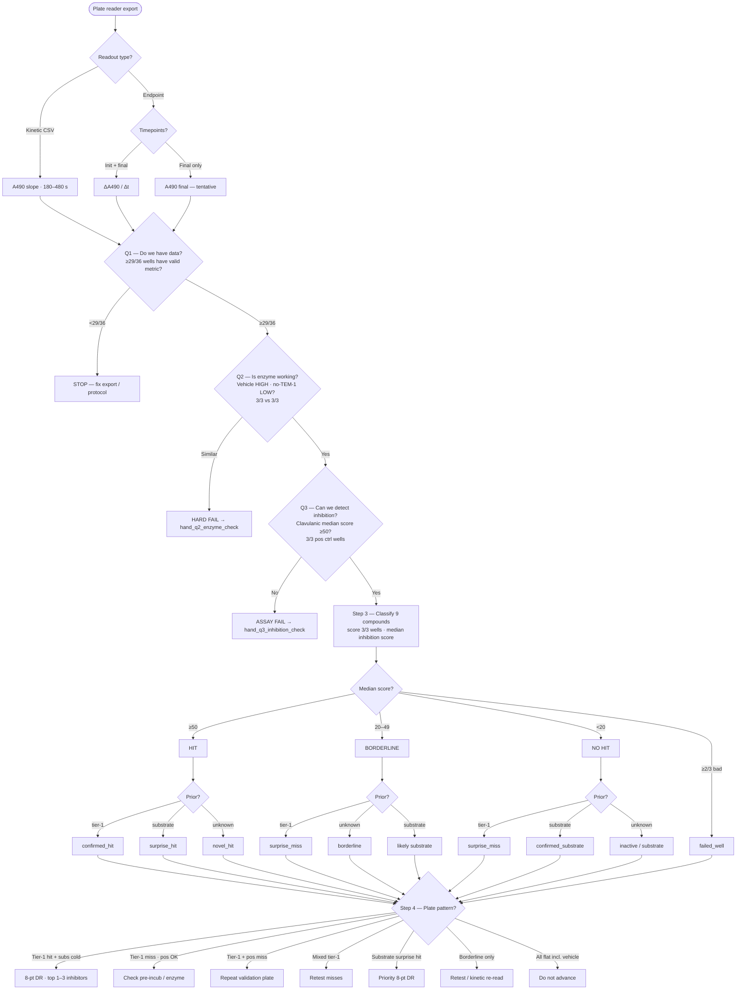
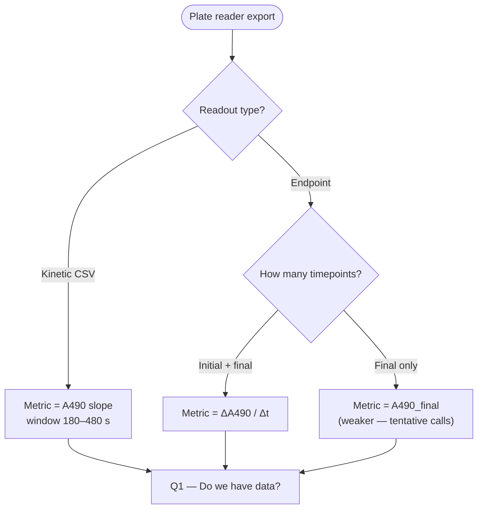
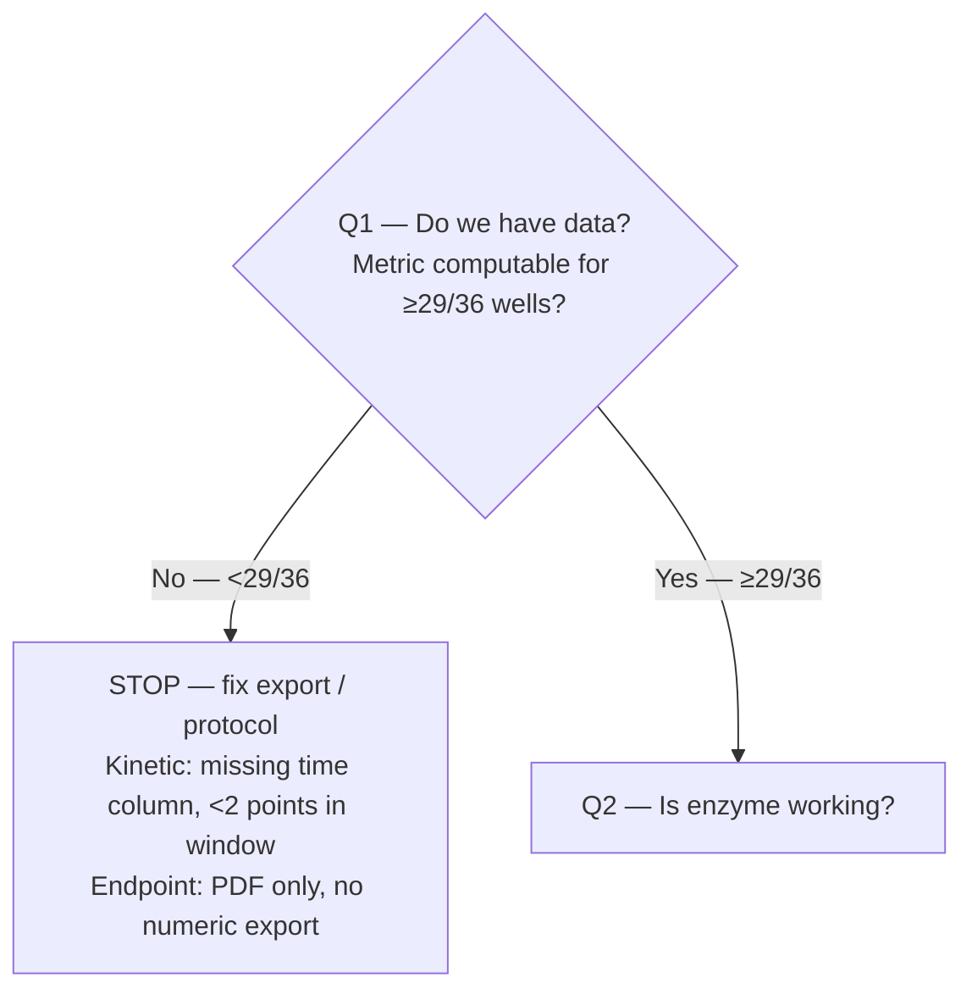
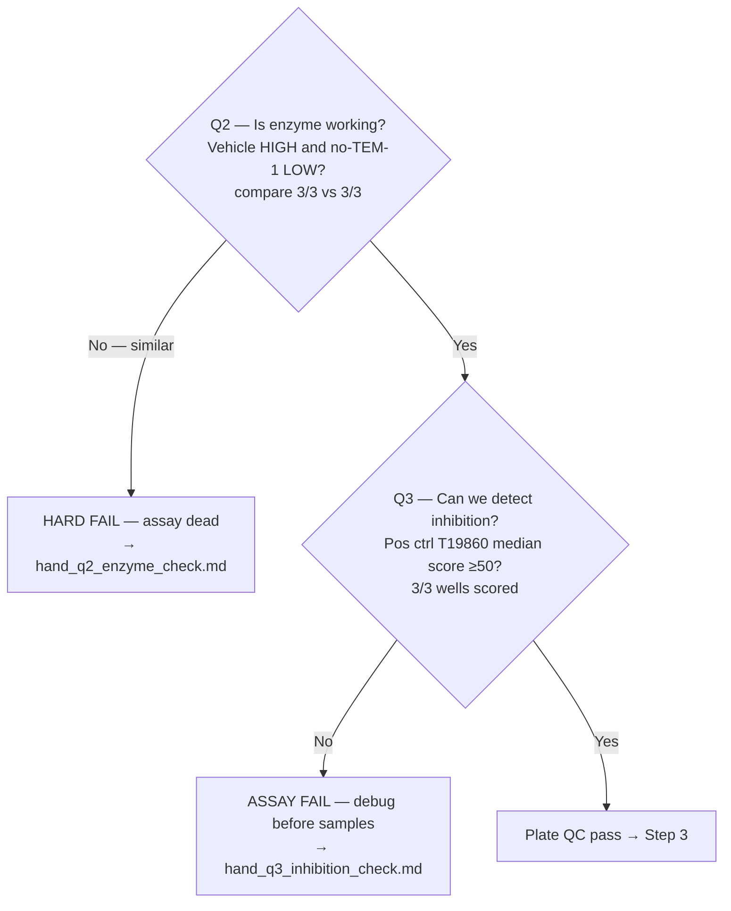
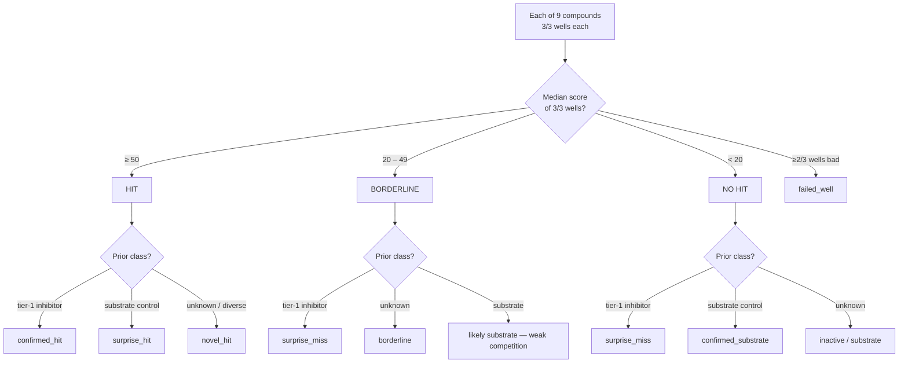
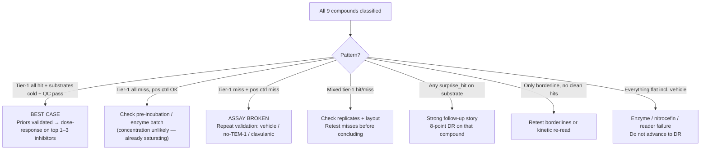

# Run 2 v5 — experiment decision tree

**Round:** 2 · **Version:** 5 (`r2-discovery-v5`)  
**Plate map:** [`data/screens/2/v5/plate_map.json`](../../../../data/screens/2/v5/plate_map.json)  
**Kinetic schedule:** [`kinetic_schedule.json`](kinetic_schedule.json) · [`pvjthomas/output/kinetic_schedule_r2_v5.json`](../../../output/kinetic_schedule_r2_v5.json)

Use this tree after the nitrocefin TEM-1 screen completes. It covers **kinetic** (preferred) and **endpoint** readouts.

---

## Plate layout (reminder)

**36 assay wells total** — every condition is **triplicate (3/3 reps)**:

| Type | Wells | Role |
|------|-------|------|
| Discovery samples | 27/36 (9 compounds × 3 reps) | `sample` |
| Positive control | 3/36 — T19860 clavulanic @ 50 µM × 3 | `pos-ctrl-clavaculin` |
| Vehicle | 3/36 — DMSO + TEM-1 × 3 | `vehicle` |
| No-TEM-1 | 3/36 — DMSO, no TEM-1 × 3 | `no_tem1` |

Clavulanic acid is **not** in the 9-sample list — positive control only.

---

## What is `pct_inhibition`? (inhibition score)

**This is not a count of wells.** It is a **single number computed for each well** (each of the 36/36 assay wells gets its own score).

It answers: *how much did nitrocefin turnover in this well get suppressed, compared to the on-plate controls?*

| Anchor | Inhibition score | What the kinetics look like |
|--------|------------------|----------------------------|
| **Vehicle** (DMSO + TEM-1, 3/3 wells) | **0** | Fast red — enzyme fully active |
| **No-TEM-1** (3/3 wells) | **100** | Flat — no enzyme activity |
| **Sample well** | **0–100+** | Between those extremes |

Formula (per well):

```
inhibition_score = 100 × (1 − (metric_sample − metric_no_tem1) / (metric_vehicle − metric_no_tem1))
```

(`pct_inhibition` in code — same thing.)

**How controls enter:** take the **median metric from 3/3 vehicle wells** and **median from 3/3 no-TEM-1 wells**, then plug into the formula for each sample well.

**How compounds get a call:** score **each of 3/3 sample wells**, then take the **median of those 3 scores** → one number per compound.

---

## Scoring (both readout modes)

Kinetic and endpoint answer the same question: **how fast is nitrocefin turning red?**

| Readout | Wavelength | Metric (per well) |
|---------|------------|-------------------|
| **Kinetic** | **490 nm** | Slope of A490 vs time in **180–480 s** kinetic window (see `kinetic_schedule.json`) |
| **Endpoint** | **450/490 nm** | `(A490_final − A490_initial) / Δt`, or A490 at a single late time if no baseline |

### Compound calls (median of 3/3 sample wells)

| Call | Wells scored | Inhibition score rule (median of 3/3) | Meaning |
|------|--------------|----------------------------------------|---------|
| **Hit** | 3/3 | ≥ 50 | Strong inhibitor — looks like no-TEM-1 vs vehicle |
| **Borderline** | 3/3 | 20 – 49 | Weak or ambiguous |
| **No hit** | 3/3 | < 20 | Substrate-like or inactive — looks like vehicle |
| **Failed compound** | **≥2/3** reps bad | any score outside 0–150, or bad curve | Exclude compound call |

**Note:** A strong inhibitor gives a **flat** kinetic slope (like no-TEM-1). That is a score near **100**, not a missing-enzyme artifact, as long as vehicle stays hot.

### Per-well bad-data flags (either mode)

- Inhibition score outside **0–150** (1/1 well flagged)
- Non-monotonic or negative slope (kinetic)
- Replicate spread too high across **3/3** reps (CV > ~50% with no clear biological reason)

---

## Full decision tree (all steps)



| Gate | Question | Pass |
|------|----------|------|
| **Q1** | Do we have data? | **≥29/36** wells have valid metric |
| **Q2** | Is enzyme working? | **3/3** vehicle hot, **3/3** no-TEM-1 flat | Fail → [hand_q2_enzyme_check.md](hand_q2_enzyme_check.md) |
| **Q3** | Can we detect inhibition? | **3/3** clavulanic median score ≥50 | Fail → [hand_q3_inhibition_check.md](hand_q3_inhibition_check.md) |

---

## Step 0 — What data did you get?



---

## Step 1 — Data quality gate

**What “wells OK” means:** for each of the **36/36 plated assay wells**, can you compute the readout metric (kinetic slope in the 180–480 s window, or endpoint ΔA490/Δt)? Pass if **≥29/36 wells** have a valid metric — i.e. at most **7/36** wells may be missing or unusable.



**Failed-well flags (either mode):**

- Inhibition score outside 0–150 for that well
- Non-monotonic or negative slope (kinetic)
- **3/3** reps disagree too much (CV > ~50%) with no clear biological reason

---

## Step 2 — Control gate (must pass before sample calls)

**If Q2 or Q3 fails, run the matching hand protocol before touching discovery data:**

| Fail | Hand protocol | Wells |
|------|---------------|-------|
| **Q2** — enzyme dead | [hand_q2_enzyme_check.md](hand_q2_enzyme_check.md) | 10/96 |
| **Q3** — inhibition not detected | [hand_q3_inhibition_check.md](hand_q3_inhibition_check.md) | 12/96 |



| Control | Reps | Kinetic expectation | Endpoint expectation |
|---------|------|--------------------|-----------------------|
| **Vehicle** (DMSO + TEM-1) | 3/3 | Steep slope | Large ΔA490 |
| **No-TEM-1** (DMSO, no enzyme) | 3/3 | Flat (~0 slope) | Small ΔA490 |
| **Positive T19860** (clavulanic) | 3/3 | Flat vs vehicle | Small ΔA490 vs vehicle |

---

## Step 3 — Classify each sample (median of 3/3 wells)

Score **each of 3/3 sample wells**, then use **median inhibition score** per `compound_id`.



### Post-hoc labels

| Label | Criteria |
|-------|----------|
| `confirmed_hit` | Median score ≥50 (3/3 wells) + tier-1 inhibitor (T1262, T6685, T14081) |
| `confirmed_substrate` | Median score <20 (3/3 wells) + substrate control (T1005, T1008, T0224, T0985) |
| `surprise_hit` | Median score ≥50 + expected substrate or unknown |
| `surprise_miss` | Median score <20 (or borderline) + expected tier-1 inhibitor |
| `borderline` | Median score 20–49 on unknown — retest or mini dose-response |
| `failed_well` | **≥2/3** of 3 sample wells bad kinetics or score outside 0–150 |

### Sample priors (v5 compound list)

| Slot | ID | Name | Screen µM | Expected (median of 3/3) |
|------|-----|------|-----------|---------------------------|
| 1 | T1262 | Tazobactam | 1.0 | score ≥50 (`confirmed_hit`) |
| 2 | T6685 | Sulbactam sodium | 50 | score ≥50 |
| 3 | T14081 | Enmetazobactam | 50 | score ≥50 |
| 4 | T1005 | Amoxicillin | 50 | score <20 (`confirmed_substrate`) |
| 5 | T1008 | Cephalexin | 50 | score <20 |
| 6 | T0224 | Meropenem | 50 | score <20 |
| 7 | T0985 | Oxacillin sodium salt | 50 | score <20 |
| 8 | T0138 | Cefpiramide acid | 50 | uncertain |
| 9 | T8390 | Cefazolin | 50 | uncertain |

---

## Step 4 — Plate-level outcome → next action



| Plate outcome | Next step |
|---------------|-----------|
| Best case | 8-point dose-response (3–400 µM) on top inhibitors |
| Surprise hit | Priority dose-response on that compound |
| Borderline only | Retest @ 50 µM (4th rep) or mini-DR |
| Tier-1 surprise miss | Assay debug — do not trust negative calls on other wells |
| Hard assay fail | Fix protocol; run [hand_q2](hand_q2_enzyme_check.md) or [hand_q3](hand_q3_inhibition_check.md); then re-run validation |

---

## Kinetic vs endpoint — interpretation differences

| Situation | Kinetic (490 nm) | Endpoint (450/490 nm) |
|-----------|------------------|------------------------|
| Strong inhibitor | Flat slope in window | Low ΔA490 |
| Substrate / no inhibition | Steep slope | High ΔA490 |
| Partial inhibition | Intermediate slope | Intermediate ΔA490 |
| Bad well | Noisy / non-linear curve | Outlier ΔA490 vs reps |
| Confidence | Higher — linear phase visible | Lower — prefer initial + final, not single read |

**Endpoint fallback:** If only one timepoint is available, run the same tree but mark borderline calls **tentative** and plan a kinetic re-read or replicate boost.

---

## Expected pattern (assay working)

```
Well type              Reps   Kinetic          Endpoint (~10 min)
──────────────────────────────────────────────────────────────────
Vehicle                3/3    HIGH slope       HIGH ΔA490
No-TEM-1               3/3    ~ZERO            ~ZERO ΔA490
Clavulanic (pos ctrl)  3/3    ~ZERO            ~ZERO ΔA490
Tier-1 inhibitors      3/3    ~ZERO            ~ZERO ΔA490
Substrate controls     3/3    HIGH             HIGH ΔA490
```

---

## Analysis tooling

| Task | Command / file |
|------|----------------|
| Kinetic analysis | `ml/analysis/kinetics.py` → `analyze_kinetics_file()` |
| Plate map | `data/screens/2/v5/plate_map.json` |
| Output summary | `data/assay/run_2_summary.json` (labels per compound) |
| Hit threshold | Median inhibition score ≥50 across 3/3 sample wells (`HIT_THRESHOLD_PCT = 50.0`) |

---

## Related docs

- [hand_q2_enzyme_check.md](hand_q2_enzyme_check.md) — Q2 fail: 10-well hand enzyme check
- [hand_q3_inhibition_check.md](hand_q3_inhibition_check.md) — Q3 fail: 12-well hand inhibition check
- [selection_rationale.md](selection_rationale.md) — layout and compound picks
- [NITROCEFIN_ASSAY.md](../../../NITROCEFIN_ASSAY.md) — mixing order, controls, scoring
- [FUTURE_EXPERIMENTS.md](../../../../FUTURE_EXPERIMENTS.md) — Phase 2–3 follow-up experiments
- [data/assay/README.md](../../../../data/assay/README.md) — summary JSON schema and labels
