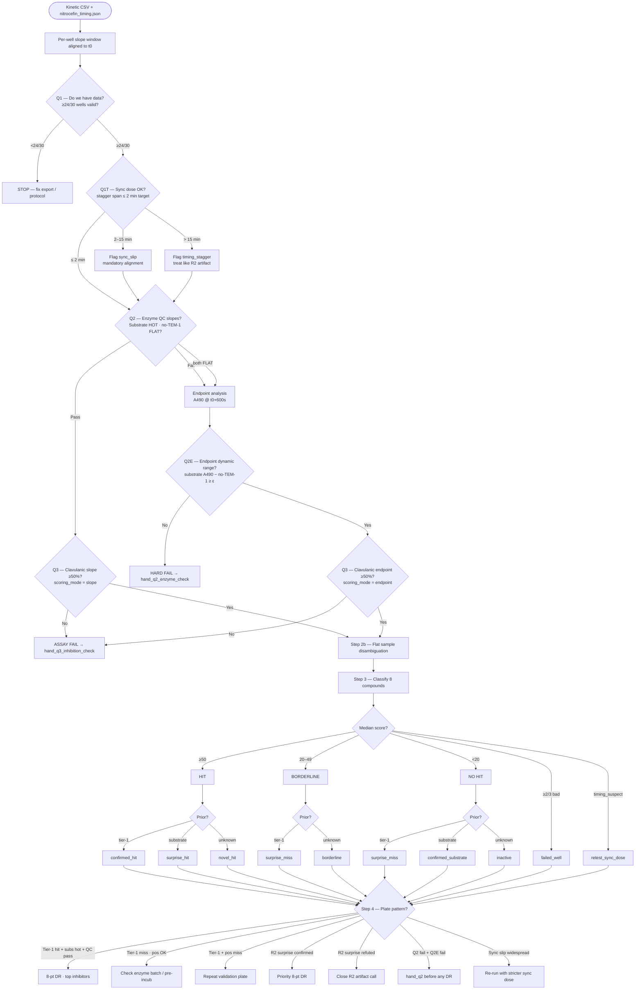
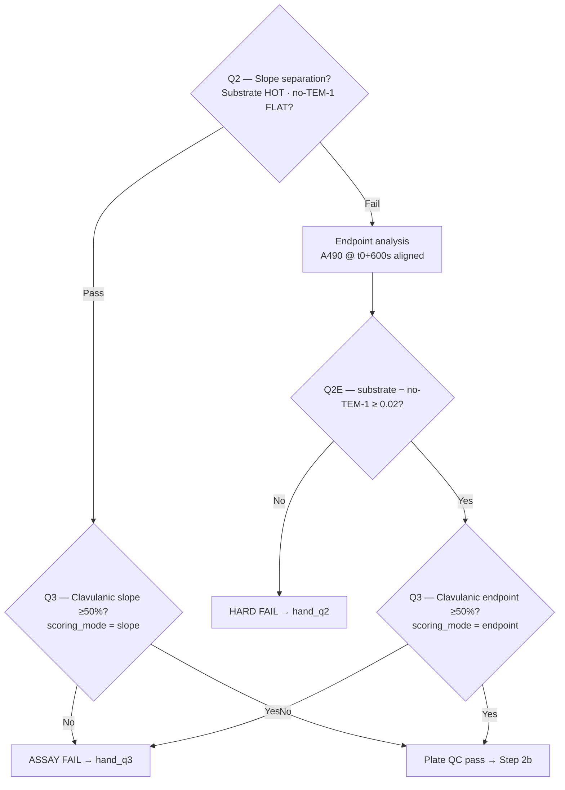

# Run 3 v1 — experiment decision tree

**Round:** 3 · **Version:** 1 (`r3-discovery-v1`)  
**Plate map:** [`data/screens/3/v1/plate_map.json`](../../../../data/screens/3/v1/plate_map.json)  
**Prior round:** [Run 2 v5 decision tree](../../2/v5/run2_decision_tree.md) (stagger artifact → endpoint rescue → this plate)

Use this tree after the **kinetics validation** plate completes. Readout is kinetic — Gen5 method at **490 nm**, A490 every 30 s for 600 s after 120 s equilibration (same schedule as Run 2).

**Protocol change from Run 2:** operator adds nitrocefin to **all wells synchronously** (12-channel pipette, ≤ 2 min span) before starting the reader. Robot loads enzyme + compounds only.

**Timing input:** per-well nitrocefin `t0_utc` from `nitrocefin_timing.json` (hand-dispense log or manual timestamp).

**Figure:** [`r3_decision_tree.png`](r3_decision_tree.png) — regenerate with `python ml/scripts/generate_r3_decision_tree_figure.py`

---

## Plate layout (reminder)

**30 assay wells total** — every condition is **triplicate (3/3 reps)**:

| Type | Wells | Role |
|------|-------|------|
| Retest samples | 24/30 (8 compounds × 3 reps) | `sample` |
| Positive control | 3/30 — T19860 clavulanic @ 50 µM × 3 | `pos-ctrl-clavaculin` |
| No-TEM-1 | 3/30 — DMSO, no TEM-1 × 3 | `no_tem1` |

**No vehicle wells** on this plate. Active-enzyme anchor for scoring comes from **substrate control wells** (T1008, T0224, T0985 — 9/30 wells, bucket `substrate_control`).

---

## Scoring anchor (no vehicle)

Run 2 used vehicle (DMSO + TEM-1) as the 0% inhibition reference. Run 3 uses the **median of substrate-control sample wells** instead:

| Anchor | Inhibition score | Expected kinetics |
|--------|------------------|-------------------|
| **Substrate controls** (T1008, T0224, T0985 × 3) | **0** | HOT slope / high A490 |
| **No-TEM-1** (3/3) | **100** | FLAT / low A490 |
| **Sample well** | **0–100+** | Between those extremes |

Same formulas as Run 2 — substitute `metric_substrate_median` wherever Run 2 used `metric_vehicle`:

```
inhibition_score = 100 × (metric_substrate − metric_sample) / (metric_substrate − metric_no_tem1)
```

(`anchor_mode = substrate` in analysis output.)

---

## Scoring mode (slope primary → endpoint fallback)

Identical macro flow to Run 2:

| Mode | When | Per-well metric |
|------|------|-----------------|
| **`slope`** | Q2 pass — substrate HOT, no-TEM-1 FLAT | A490 **slope** in aligned 180–480 s window |
| **`endpoint`** | Q2 fail — slopes ambiguous / all flat | A490 at **t0 + 600 s** (aligned reaction time) |

Slopes are **always** computed for QC. Compound `% inhibition` uses endpoint when slope Q2 fails **and** Q2E passes.

**Why endpoint fallback still matters on R3:** sync dosing should make slope Q2 pass, but a flat-plateau assay, reader timing slip, or enzyme batch issue can still collapse slope separation. Endpoint A490 separates active enzyme (high substrate absorbance) from inhibition (low sample absorbance) even when derivatives are ~zero.

---

## Full decision tree



| Gate | Question | Pass |
|------|----------|------|
| **Q1** | Do we have data? | **≥24/30** wells have valid metric |
| **Q1T** | Sync dose? | Stagger span ≤ **2 min** (target); warn if 2–15 min; flag `timing_stagger` if >15 min |
| **Q2** | Is enzyme working (slopes)? | **≥6/9** substrate wells **HOT**, **≥2/3** no-TEM-1 **FLAT**, substrate median slope ≥ **3×** no-TEM-1 | Fail → **endpoint fallback** (not immediate stop) |
| **Q2E** | Endpoint dynamic range? | **≥6/9** substrate and **≥2/3** no-TEM-1 endpoints; `median(A490_substrate) − median(A490_no_tem1) ≥ 0.02` | Fail → [hand_q2_enzyme_check.md](../../2/v5/hand_q2_enzyme_check.md) |
| **Q3** | Can we detect inhibition? | Clavulanic median score ≥50 (slope or endpoint per `scoring_mode`) | Fail → [hand_q3_inhibition_check.md](../../2/v5/hand_q3_inhibition_check.md) |

---

## Step 2 — Control gate (Q2 slope → endpoint fallback / Q3)

**Macro flow:** always compute slopes for Q2. If Q2 passes → `scoring_mode = slope`. If Q2 fails → compute aligned endpoint A490 and set `scoring_mode = endpoint` (requires Q2E pass).



### Q2 fail patterns (same routing as Run 2)

| Substrate slope | No-TEM-1 slope | Likely cause | Route |
|-----------------|----------------|--------------|-------|
| FLAT | FLAT | Dead enzyme / nitrocefin / reader | → **endpoint fallback** (Q2E) |
| HOT | HOT | Enzyme in NT wells or background drift | → hand_q2 |
| FLAT | HOT | Pipetting error | → hand_q2 |
| AMBIGUOUS | AMBIGUOUS | Weak signal | → endpoint fallback (Q2E) |

If **Q2E also fails** after endpoint fallback, run [hand_q2_enzyme_check.md](../../2/v5/hand_q2_enzyme_check.md) before trusting any compound call.

---

## Step 3 — Classify each sample (median of 3/3 wells)

Same label rules as Run 2. R3-specific priors:

| Slot | ID | Name | Expected (median of 3/3) |
|------|-----|------|---------------------------|
| 1 | T1262 | Tazobactam | score ≥50 (`confirmed_hit`) |
| 2 | T6685 | Sulbactam sodium | score ≥50 |
| 3 | T14081 | Enmetazobactam | score ≥50 |
| 4 | T1008 | Cephalexin | score <20 (`confirmed_substrate`) |
| 5 | T0224 | Meropenem | score <20 (R2 artifact — retest) |
| 6 | T0985 | Oxacillin sodium salt | score <20 |
| 7 | T0138 | Cefpiramide acid | uncertain |
| 8 | T8390 | Cefazolin | score <20 / borderline |

---

## Step 4 — Plate-level outcome → next action

| Plate outcome | Next step |
|---------------|-----------|
| Tier-1 all hit + substrates hot + QC pass | 8-point dose-response on top inhibitors |
| R2 surprise hit **confirmed** (T0224, T1008, T0138) | Priority dose-response on that compound |
| R2 surprise hit **refuted** | Close artifact call; do not advance DR from R2 endpoint data |
| Tier-1 surprise miss | Assay debug — check enzyme batch before broader conclusions |
| Q2 fail + Q2E pass (endpoint mode) | Callable but note `scoring_mode = endpoint`; prefer slope re-run if borderline |
| Q2 fail + Q2E fail | [hand_q2](../../2/v5/hand_q2_enzyme_check.md) — do not advance |
| Widespread `timing_suspect` despite sync dose | Re-run with tighter multichannel timing (≤ 2 min) |

---

## Expected pattern (assay working, slope mode)

```
Well type              Reps   Kinetic (490 nm, aligned window)
──────────────────────────────────────────────────────────────
Substrate controls     9/9    HOT slope (anchor = 0% inhib)
No-TEM-1               3/3    FLAT (~zero)
Clavulanic (pos ctrl)  3/3    FLAT (~zero vs substrate)
Tier-1 inhibitors      3/3    FLAT (~zero vs substrate)
Substrate controls     3/3    HOT (by definition)
```

---

## Comparison to Run 2 decision tree

| | Run 2 v5 | Run 3 v1 |
|---|----------|----------|
| Nitrocefin add | Robot stagger (~16 min) | Hand sync (≤ 2 min) |
| Scoring anchor | Vehicle (DMSO + TEM-1) | Substrate controls |
| Primary mode | Endpoint (Q2 failed) | **Slope** (expected) |
| Endpoint fallback | Used on R2 data | **Same Q2E/Q3E path** if slope Q2 fails |
| Step 4 default | Human multichannel nitrocefin → R3 | Dose-response or close R2 artifact calls |

---

## Analysis tooling

| Task | Command / file |
|------|----------------|
| Kinetic analysis | `ml/analysis/kinetics.py` → `analyze_kinetics_file()` |
| Plate map | `data/screens/3/v1/plate_map.json` |
| Hand protocols (shared) | [hand_q2](../../2/v5/hand_q2_enzyme_check.md) · [hand_q3](../../2/v5/hand_q3_inhibition_check.md) |
| R2 post-run context | [`data/screens/2/post-run/v2/conclusions.md`](../../../../data/screens/2/post-run/v2/conclusions.md) |

---

## Related docs

- [selection_rationale.md](selection_rationale.md) — compound picks and R2 priors
- [Run 2 decision tree](../../2/v5/run2_decision_tree.md) — full slope/endpoint spec (shared formulas)
- [NITROCEFIN_ASSAY.md](../../../NITROCEFIN_ASSAY.md) — mixing order, controls, scoring
